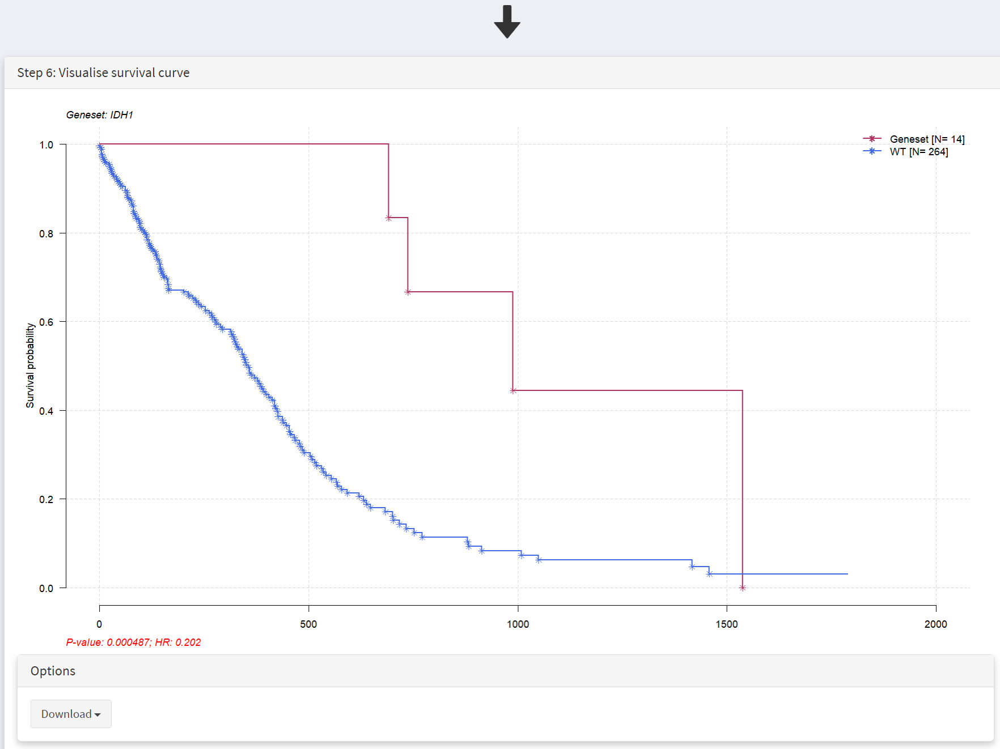

**Short study 2**

From: CRUX, a platform for visualising, exploring and analysing cancer
genome cohort data, by El-Kamand *et al*.

Please cite the above publication and the authors of any external tools
accessed using CRUX.

**Identify biomarkers associated with patient survival by integrating
genome molecular alterations with clinical data.**

Dataset: The inbuilt GBM cohort dataset (n = 283) from TCGA, as in short
study 1.

Here we study how patient survival in the GBM cohort relates to
mutations in genes of interest. The first step is to access the Survival
Analysis page, which is available under the Single Cohort Genomics menu
on the Crux sidebar [screenshot 1].

On this page the GBM dataset is selected and loaded. In the Step 1
panel, ‘glioblastoma’ entered in the selection field brings up the
Glioblastoma multiforme dataset, which is then selected. The Filter
Dubious Genes is also selected on that panel. In the Step 2 panel the
Time To Event dropdown menu is selected and option
‘days_to_last_followup’ chosen. From the Event Status dropdown menu
‘vital_status’ option is chosen. These two options delineate the time to
event needed for the patients of this GBM dataset.

Further filtering of the geneset can be performed on Step 3 panel
[screenshot 2], changing these filter values can greatly affect the
output table:

-  ’Only consider the top N genes’ filter - genes are ranked by number
   of samples bearing mutations in them, and removes all genes outside
   the top N highly ranked genes. These N genes are passed to the table.
   Note that the table does not use this ranking as it ranks by hazard
   ratio p-value.

-  ‘Geneset size’ filter – setting this to 1 (default) looks at genes
   individually, while setting to 2 means that pairs of genes are
   examines, so that samples with mutations in a pair of 2 genes (such
   as *TP53* and *RB1*) are considered and compared to other gene pairs.

-  ‘Minimum size’ filter – excluded genes that show mutations in fewer
   than this number of samples.

Changing these filters can greatly alter the genes included in the table
in screenshot 3. It is also important to remove genes with many
passenger mutations using the filter dubious genes button.

.. image:: ../images/manuscript_screenshots/study2/media/image2.png
   :width: 6.22174in
   :height: 2.19691in

This populates the Step 4 panel with a list of genes ordered by the
p-value of the survival hazard ratio, comparing survival of patients
that have mutations in a specific gene with patients that do not.
Screenshot 3 shows the data for from the top 10 genes in GBM, with
*IDH1* mutations (p-value of 0.000487) at the top of the list. The
hazard ratio of 0.202 is well below 1, indicating much better survival
of these patients than those without *IDH1* mutations. Note that only 14
patients have *IDH1* mutations. None of the genes beyond TP53 show
p-value less than 0.05 .

.. image:: ../images/manuscript_screenshots/study2/media/image3.png
   :width: 6.22174in
   :height: 2.19691in

Screenshot 4 shows the next 10 genes on this list; the top 20 genes were
selected. Note that in the CRUX manuscript (Fig. 3). Note that in the
manuscript gene *STAG2* was included in the table as the top N gene
filter was set to 40, and *STAG2* is mutated in only 12 samples; this is
an example of the effects of changing this filter number.

.. image:: ../images/manuscript_screenshots/study2/media/image4.png
   :width: 6.22174in
   :height: 2.19691in

Plotting of survival information for a gene is performed on the Step 5
panel. To examine *IDH1* mutations this gene is selected under the
Select Genest menu [screenshot 6].

This selection produces a Kaplan Meier plot in the Step 6 Visualisation
panel [screenshot 7]. Note that the gene (or genes) selected are
labelled as ‘Geneset’ and are compared to ‘WT’, i.e., no mutation. More
than one gene can be selected so that the effects of gene mutation
combinations can be explored.

This plot can be downloaded for use using the Download button as seen in
screenshot 8.

.. image:: ../images/manuscript_screenshots/study2/media/image7.png
   :width: 6.22174in
   :height: 2.19691in

Next to identify the mutations of interest we move to the Lollipop and
select the GBM dataset, as shown in screenshot 9.\ |image1|

This gives the Lollipop plot for the selected gene. Screenshot 10 shows
the consequences of the mutation for the protein (and defined protein
domains), one the Step 2 panel. Here *IDH1* was selected in the lower
part of the panel under the Gene menu [screenshot 11]. For this gene it
is notable that mutations are only seen at one site corresponding to
amino acid 132.

.. image:: ../images/manuscript_screenshots/study2/media/image10.png
   :width: 6.22174in
   :height: 4.02317in

.. |image1| image:: ../images/manuscript_screenshots/study2/media/image8.png
   :width: 6.22174in
   :height: 1.58681in
