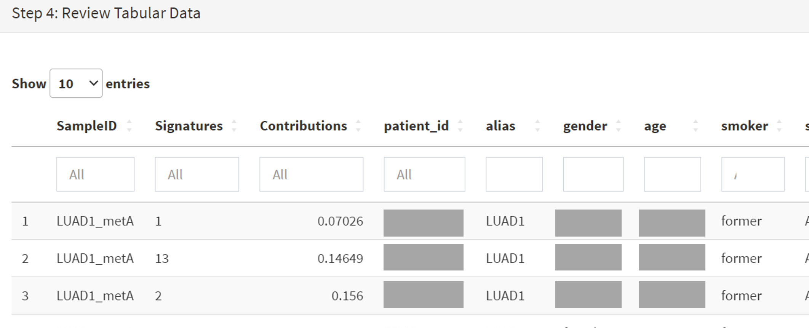
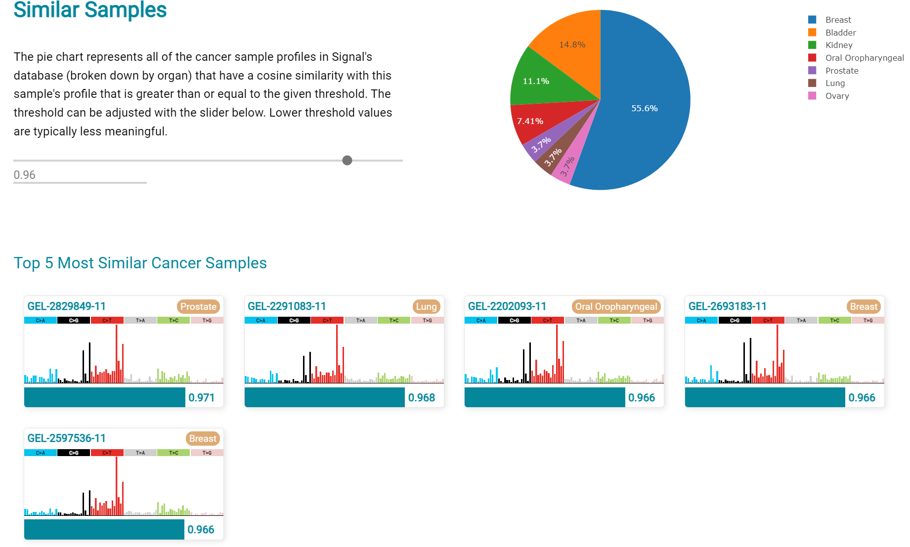
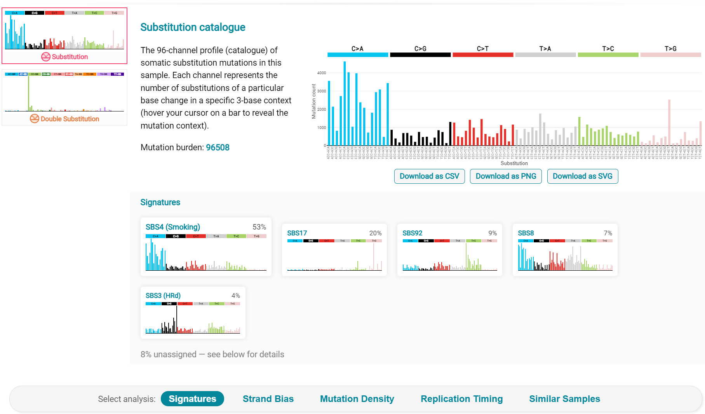

**Short study 4**

From: CRUX, a platform for visualising, exploring and analysing cancer
genome cohort data, by El-Kamand *et al*.

Please cite the above publication and the authors of any external tools
accessed using CRUX.

**Mutation signature analysis of cohort data.**

*Dataset*: We created a new dataset in CRUX by importing published
variant calls from a previous study of 30 lung tumours sequenced with
deep multi-region whole genome sequencing (WGS), merging this with the
associated clinical data. These data are from Leong et al 2019,
manuscript reference 24 (PMID: 30348992) and is available from European
Nucleotide Archive (https://www.ebi.ac.uk/ena) accession number
PRJEB28616. The patients included current, former, and non-smokers, and
the tumour biopsies were from paired primary and metastatic tumour
biopsies. The data was in VCF file format, which we annotated using a
command line vcf2maf tool available at https://github.com/mskcc/vcf2maf
to create the MAF files employed here. Further clinical annotation used
data (CSV filetype) on patient smoking status.

In this study we examine somatic variant signatures in lung cancer data.
These signatures are patterns of single nucleotide mutations which can
provide mutagenesis mechanisms and other information regarding tumour
development; the signatures used are COSMIC V3. Analysis employed two
external tools, Mutalisk (http://mutalisk.org/analyze.php) and Signal
(https://www.signaldb.org/). For this work MAF files are first uploaded,
then the additional clinical data (smoking status of participants);
these are merged an loaded into CRUX.

From the Import Data selection (under the Data menu on the CRUX
sidebar), a panel opens as seen is screenshot 1. After selecting MAF
filetyping in Step 1 panel, the relevant MAF file was chosen was located
using the Browse button in Step 2 panel then uploaded.

.. image:: ../images/manuscript_screenshots/study4/media/image1.png
   :width: 6.22174in
   :height: 3.20408in

The additional clinical annotations file was similarly located, selected
and uploaded from the STEP 2 panel [screenshot 2].

In the Step 4 panel the files were then given the name (‘Lung Cancer’)
that they will carry when loaded in CRUX. The Import button (blue) was
then pressed [screenshot 3

Import to CRUX was confirmed after 20 second delay [screenshot 4].

Selecting the External Tools (CRUX sidebar) opens a page where the
dataset is chosen [screenshot 5]. Note that the Dubious Genes filter is
not selected as the passenger mutations in these genes are required for
the signature analyses.

In the External Tools Step 2 panel ‘Mutalisk’ is selected, and the data
exported at Step 3; this arrives in the computer download folder as a
zipped folder called ‘Lung Cancer_Mutalisk’, the dataset name in CRUX.
This contains VCF data files for all the samples, and it is best to open
the folder and copy the uncompressed files to a nearby location. These
individual files will be uploaded to Mutalisk as described below.

Note that in the Step 5 panel there is information about using Mutalisk:

Instructions

1. Unzip exported file

2. Click 'Upload Files' and select all samples you want to run signature
   analysis on

3. Select reference build (Human GRCh37 if using pre-packaged TCGA/PCAWG
   datasets)

4. Select the relevant Disease Type mutalisk will automatically choose
   relevant signatures to screen in sample. An alternate unbiased
   approach is to screen against all PCAWG (V3) signatures. To do this
   expand the PCAWG tab and 'select all' signatures. You do not need to
   specify a disease.

5. Run analysis

Next press the Go to Mutalisk button selected in Step 4 panel.

.. image:: ../images/manuscript_screenshots/study4/media/image6.png
   :width: 6.22174in
   :height: 3.56327in

CRUX then opens a browser window running Mutalisk [screenshot 7].

However, the ‘COSMIC’ signatures are not the most up to date. To select
the correct type of COSMIC V3 signatures it is necessary to select the
PCAWG – Sig profiler option below it. Then the signature types to be
examined are designated using the Select all button [screenshot 8].

.. image:: ../images/manuscript_screenshots/study4/media/image8.png
   :width: 5.66279in
   :height: 4.22543in

Then the +Add Files option is pressed, the files exported from CRUX are
chosen (unzipped) and the files are processed [screenshot 9]. The RUN
button is then pressed and the analysis proceeds as indicated. Note that
this processing is slow and can take several hours for 30 samples. The
initial stage of processing is shown in screenshot 9. Mutalisk gives a
process number so the user can exit and return to see progress later.

Mutalisk then outputs a number of analyses for each dataset input. Some
of these are in downloaded PDF files; examples for LUAD1 are shown in
screenshots 10 to 13. For example, screenshots 10 and 11 show kataegis
analysis output for LUAD1 and LUAD7, respectively, showing a
predominance of C>A mutations in the latter but not the former.

Screenshot 12 shows the Mutalisk signature output from sample
LUAD7_primary1, a primary lung tumour showing a typical smokers profile
with high SBS4. Highlighted (blue line) is the signature plot presented
in El-Kamand et al Figure 5C (recoloured for clarity). The signature
proportion varies slightly over time as the signature data is updated in
the Mutalisk portal.

.. image:: ../images/manuscript_screenshots/study4/media/image12.png
   :width: 6.26806in
   :height: 3.64082in

Screenshot 13 shows the Mutalisk signature output from sample
LUAD1_metA, a lung tumour metastasis showing a non-typical smokers
profile no detectable SBS4. Signature plot is highlighted (blue line) in
El-Kamand et al Figure 5C (recoloured for clarity).

However, for cohort wide analysis we need to load the Mutalisk data into
CRUX. At the top of the Mutalisk page the ‘Get the selected result for
all samples a once’ button is pressed [screenshot 14, red line
highlight].

.. image:: ../images/manuscript_screenshots/study4/media/image14.png
   :width: 6.26806in
   :height: 1.67755in

This downloads a zip file with a filename ending in ‘.all.samples.zip’.
The next step uses these files downloaded from Mutalisk, which are first
unzipped files and placed in an accessible folder for CRUX to navidgate
to; example files from a containing folder shown in screenshot 15. CRUX
will ignore the PDF files.

.. image:: ../images/manuscript_screenshots/study4/media/image15.png
   :width: 6.26806in
   :height: 1.3681in

When the Mutalisk files are ready, the Mutational Signatures tab (under
the Single Cohort Genomics menu located on the CRUX sidebar) is then
selected to open a new page of panels [screenshot 16]. On the first
(Step 1) panel the Lung Cancer data is selected using the ‘Please select
a dataset’ field. Then on the Step 2 panel the instructions given in the
panel have already been followed by this point, so the the next action
is to press the Browse button, and navigate to where the unipped
Mutalisk files are located. Those files are selected and opened by CRUX,
which may take a minute. When finished the blue ‘Upload Complete’ bar
should appear below.

.. image:: ../images/manuscript_screenshots/study4/media/image16.png
   :width: 6.26806in
   :height: 3.73469in

The next panels should then be visible. Step 3 panel shows a Venn
diagram indicating that the MAF and Mutalisk data match up [screenshot
17]. Note that the Filter Dubious Genes option is off.

.. image:: ../images/manuscript_screenshots/study4/media/image17.png
   :width: 5.27755in
   :height: 1.96327in

The Step 4 panel (Review Tabular Data) contains the data table,
including the signature variants and their contributions for each
sample; part of the table is shown on screenshot 18 with some details
blanked. This data can be subsetted and searched but is more easily
comprehended in the next Step.

The Step 5 panel [screenshot 19] shows the visualisation of the
signature contributions (X-axis) for each tissue sample. There are
multiple tissue samples (tumour primary samples and metastasis samples)
for comparison. Note that colours are set by Mutalisk, so in the
El-Kamand et al manuscript the chart colours have been adjusted for
clarity.

.. image:: ../images/manuscript_screenshots/study4/media/image19.png
   :width: 6.26806in
   :height: 4.42331in

Pressing the Download button at the bottom brings up the download
options shown in screenshot 20.

Next further signature analysis can be performed using the external
Signal tool with the Lung cancer data loaded into CRUX as above.

As for Mutalisk above, we first navigate to the External tool tab on the
sidebar and open that page. In the Step 1 panel the Lung Cancer dataset
is selected [screenshot 21]

.. image:: ../images/manuscript_screenshots/study4/media/image22.png
   :width: 6.26806in
   :height: 2.59592in

On the Step 2 panel the Signal tool is selected [screenshot 22] and the
data for export is downloaded using the Export Data button. Note again
that the Filter Dubious genes is off, since for signature analysis we
are not concerned with gene drivers but the general pattern of mutations
present compared to those seen in other cancers.

The filename zipped file provided is ‘Lung cancer_Signal.zip’. As
described in the Step 5 panel, unzip the file (‘signal_input1.txt’) and
navigate to the Signals portal
(https://signal.mutationalsignatures.com/analyse2).

The blue Go to Signal button is press and Signal website opens in a new
browser screen, as shown in screenshot 23.

.. image:: ../images/manuscript_screenshots/study4/media/image24.png
   :width: 6.26806in
   :height: 2.73469in

The upload data button is then pressed, which opens the upload file page
[screenshot 24]. Here, the signal_input1.txt file from CRUX is uploaded
according to instructions.

When the file finishes upload the file format must be selected as
‘[Variants]/TSV/TXT’ as seen in the screenshot 25. The reference genome
build selected (here GRCh37) and the organ chosen, here LUNG.

When the analysis is done there are a number of panels that are used to
access the analysis of individual lung cancer datasets; the first six
shown in screenshot 26.

.. image:: ../images/manuscript_screenshots/study4/media/image27.png
   :width: 6.26806in
   :height: 4.74528in

Here we are interested in tumours LUAD1_metA and LUAD7 primary1 used in
the El-Kamand et al manuscript. Clicking on the LUAD1_metA panel brings
a number of plots describing single nucleotide variants (SNV) types and
frequencies, and the proportion of COSMIC V23 signal seen in the variant
complement of this tumour. The first data shown is the Substitution
catalogue, the pattern of nucleotide substitutions in this tumour; this
is shown in screenshot 27.

There are a number of analyses we can perform from this page, listed at
the bottom, including strand bias, mutation density, replication timing
and similar samples. For each there is a text hyperlink at the bottom of
the page leading to the relevant page.

The Signatures analysis shows the relative preponderance of defined
COSMIC V3 signatures detected in the sample mutations [screenshot 28];
note that there are a range of other related visualisation provided on
this page.

.. image:: ../images/manuscript_screenshots/study4/media/image29.png
   :width: 4.92453in
   :height: 3.64151in

The Similar Samples analysis is of particular interest as it can
indicate which type of tumours (available to this database) most
resemble the mutation patterns seen in this LUAD1 tumour. Screenshot 29
shows the Similar Samples data page.

.. image:: ../images/manuscript_screenshots/study4/media/image30.png
   :width: 6.26806in
   :height: 2.99057in

Screenshot 30 shows the output when the analysis is run. The analysis is
run with a cosine threshold of 0.96 – the pie chart is similar to that
used in the El-Kamand manuscript figure 5D

This signature data suggests that the cancer LUAD1 has a pattern of
variant that most closely resembles that of Breast Cancer, and only
poorly matches Lung cancers.

Next is the analysis of the LUAD7_primary1 tumour, first showing the
substitution catalogue which can be seen to be very different to the
LUAD7 tumour [screenshot 31].

LUAD7 sample Signatures analysis (COSMIC V3 signatures) in this sample
is shown in screenshot 32. Note the prominent SBS4 smoking associated
signature, absent in LUAD1.

.. image:: ../images/manuscript_screenshots/study4/media/image33.png
   :width: 6.26806in
   :height: 3.83019in

The Similar Sample analysis of LUAD7 sample greatly resembles Lung
cancers, unlike (again) LUAD1 [screenshot 33]. This may reflect a
preponderance of lung cancers in the Signal database that are caused by
smoking.

.. image:: ../images/manuscript_screenshots/study4/media/image34.png
   :width: 6.26806in
   :height: 4.03774in
