**Short study 3**

From: CRUX, a platform for visualising, exploring and analysing cancer
genome cohort data, by El-Kamand *et al*.

Please cite the above publication and the authors of any external tools
accessed using CRUX.

**Identification of candidate driver mutations linked to therapeutic
responses in thyroid cancer.**

Dataset: The Thyroid Cancer (THCA) dataset, containing data (MAF file)
generated from whole genome sequencing for 496 patient samples.

For this study the first step from the CRUX homepage is to select and
load the thyroid carcinoma dataset. This is available from ‘Available
Data’ under the Data menu on the homepage sidebar or the Explore Public
Datasets button in the ‘Getting Started’ homepage panel. The thyroid
carcinoma dataset (THCA) dataset is brought up by typing ‘thyroid’ in
the name field [screenshot 1] or THCA into the abbreviation field.

.. image:: ../images/manuscript_screenshots/study3/media/image1.png
   :width: 6.22174in
   :height: 2.66957in

Clicking on the dataset 28 ‘Thyroid_carcinoma’ button opens the next
page; the Filter Dubious Genes button on Step 1 panel [screenshot 2] is
selected.

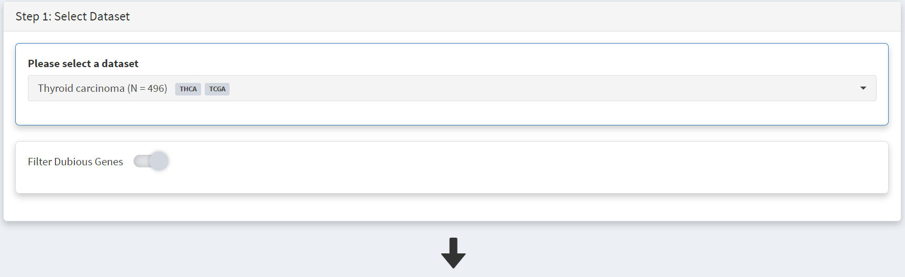

Below this in the Step 2 panel there are the Explore Visualisation tabs
[screenshot 3]. Here we use the Oncoplot tab to examine the genes with
mutations occurring in the largest number of samples. The standout gene
is *BRAF*, although *NRAS*, *HRAS, FAM47C* and *TG* are also notable.
The *NRAS* and *HRAS* are known oncogenes, *FAM47C* is a poorly
understood but widely expressed gene, while *TG* is a significant THCA
marker (encoding the thyroglobulin protein produced by thyroid tissue)
which may not be oncogenic.

.. image:: ../images/manuscript_screenshots/study3/media/image3.png
   :width: 6.23044in
   :height: 4.89565in

**Use of OncoDriveCLUSTL tool**.

OncoDriveCLUSTL is an external platform for gene driver analysis. This
is accessed using the External Tools button on the CRUX sidebar. On the
page that opens, the first step is to select the THCA dataset for
download at the Step 1 panel, as shown in screenshot 4.

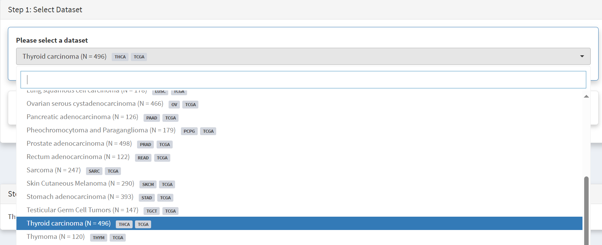

Then Filter Dubious Genes is selected [screenshot 5].

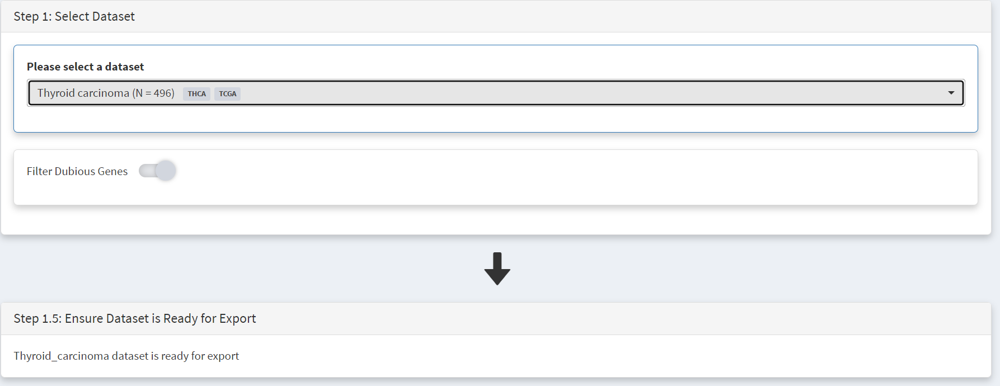

Below this is the Step 1.5 panel, where CRUX should indicate the THCA
dataset is ready for export. In the step 2 panel there is the Select
Tool tab. Usually it has the first tool (OncodriveFML) highlighted but
when clicked on the menu drops down and OncoDriveCLUSTL can be selected
[screenshot 6]

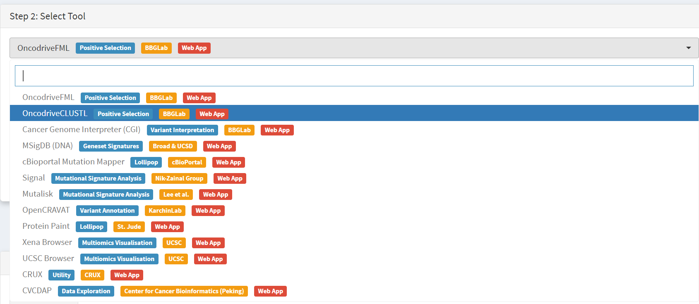

Moving to the Step 3 panel [screenshot 7], clicking on the Export Data
tab and will download the formatted THCA dataset to the user computer,
ready to upload to the OncoDriveCLUSTL platform. On the Step 4 panel,
clicking on the blue button opens a new browser window for
OncoDrivCLUSTL, at
http://bbglab.irbbarcelona.org/oncodriveclustl/analysis :

.. image:: ../images/manuscript_screenshots/study3/media/image7.png
   :width: 6.22174in
   :height: 1.96139in

On the Step 5 panel (not shown) there are instructions and information
on the tool. To use OncoDriveCLUSTL a BBGlab account needed (this is
rapidly done and is free) to log in to use the tool. As seen in
screenshot 8]. Give the analysis run a name then upload the THCA file
prepared by CRUX.

.. image:: ../images/manuscript_screenshots/study3/media/image8.png
   :width: 6.22174in
   :height: 3.28958in

After checking the terms of use button and press submit a process
progress window opens; screenshot 9 was taken shortly after starting a
data processing run.

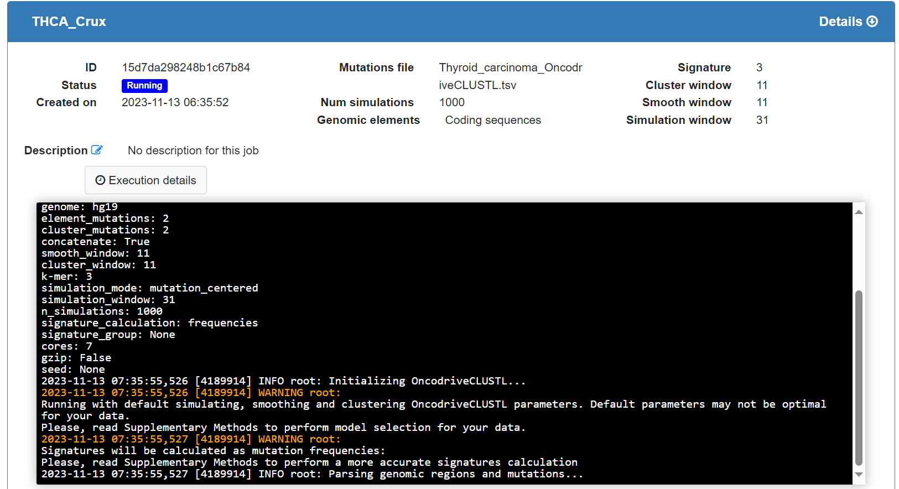

The data processing may take some time, over 15 minutes for this
dataset. The window will show the status indicator as ‘Finished’, and a
plot appears [screenshot 10] showing putative drivers with observed
versus expected p-values.

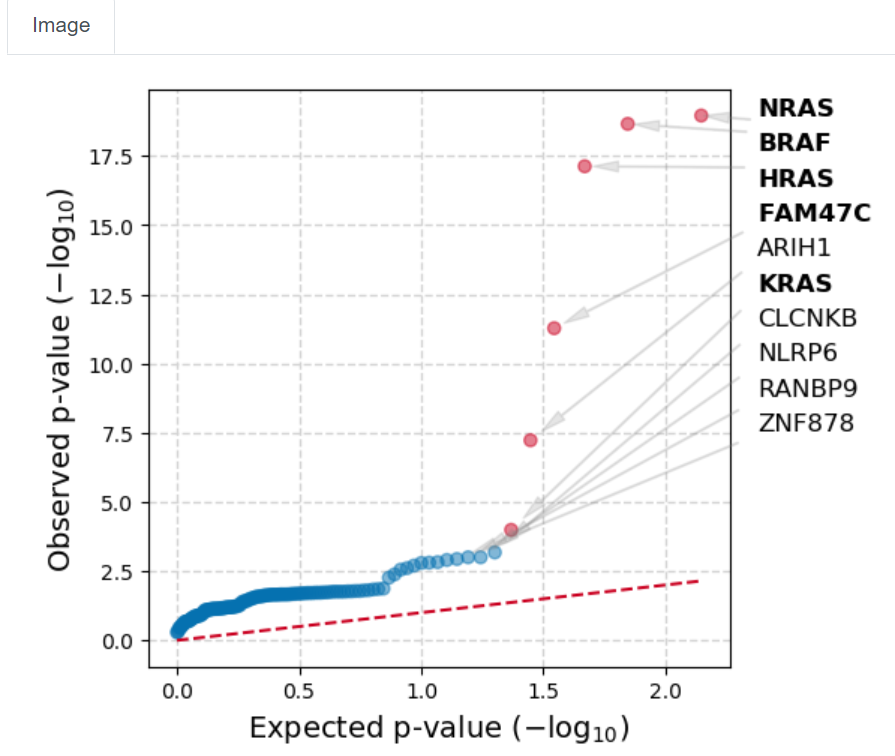

This indicates that *BRAF*, *NRAS*, *HRAS* and *FAM47C* mutations (seen
in Oncoplot) are highly selected for standout candidates to be examined.
Note that *TG* is not seen.

In the next part of the study we examine *BRAF* mutations.

**Use of cBioPortal mutation mapper tool**

As above the External tools tab is selected from the CRUX home page, the
THCA data is selected, Filter Dubious Genes selected and cBioPortal
mutation mapper selected in the Step2 panel, as in screenshot 11.

.. image:: ../images/manuscript_screenshots/study3/media/image11.png
   :width: 6.20435in
   :height: 3.13044in

We then need to select the gene, *BRAF*, in the Step 3 panel [screenshot
12].

.. image:: ../images/manuscript_screenshots/study3/media/image12.png
   :width: 6.20435in
   :height: 1.98696in

Data is then ready for download (indicated in step 1.5) using the
‘Export Data’ button on the Step 3 panel [screenshot 13]. Using the
button on the Step 4 panel will open a window for the cBioportal
Mutation Mapper at https://www.cbioportal.org/mutation_mapper .

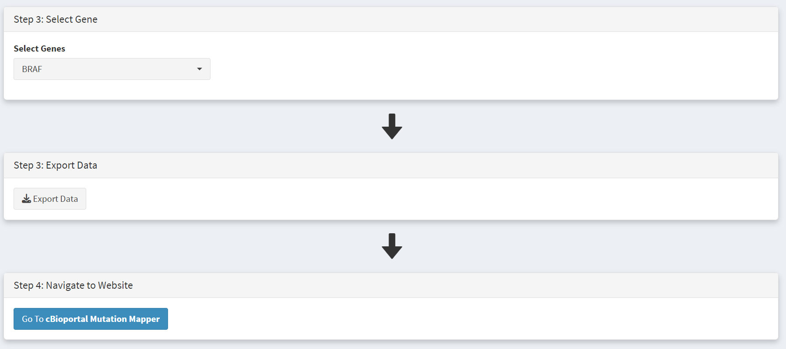

Signup for a BBGLab account may be required. The cBioportal Mutation
Mapper window is shown in screenshot 14. After login, the downloaded
file can be chosen, genome standard (GRCH37) selected, and visualisation
selected at the bottom, as on screenshot 15.

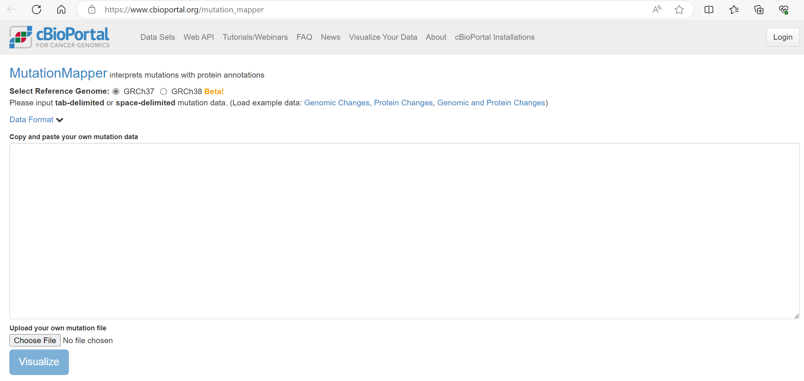

.. image:: ../images/manuscript_screenshots/study3/media/image15.png
   :width: 6.13913in
   :height: 1.38261in

A plot is returned, shown in screenshot 16.

.. image:: ../images/manuscript_screenshots/study3/media/image16.png
   :width: 6.20435in
   :height: 3.18261in

This indicates the gene domains and the presence of mutations, as well
as the mutation types and their annotations from OncoKB and others. A
plot with the mutation detail shown in screenshot 17.

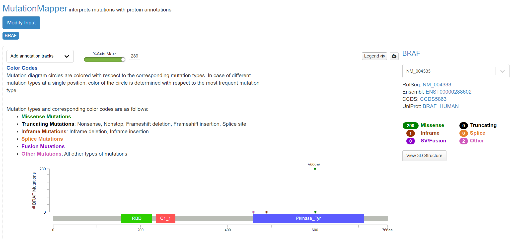

Further details of cohort mutations can be added, screenshot 18, using
the ‘Add annotation tracks’ button, seen in screenshot 18. A 3D protein
structure graphic showing the affected domain can also be obtained (not
shown).

.. image:: ../images/manuscript_screenshots/study3/media/image18.png
   :width: 6.20435in
   :height: 2.7in

**Use of Cancer Genome Interpreter (CGI) tool**

After navigating to the External tools on the home page, the CGI tool Is
selected, screenshot 19.

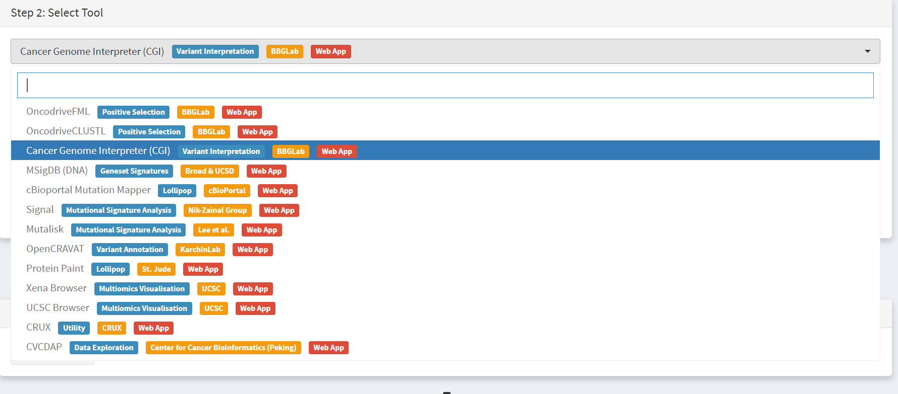

Dataset is selected and downloaded [screenshot 20] as described
previously.

.. image:: ../images/manuscript_screenshots/study3/media/image20.png
   :width: 6.04247in
   :height: 2.74903in

Clicking on the navigation button in the Step 4 panel opens a new
browser window for the CGI portal [screenshot 21] at
https://www.cancergenomeinterpreter.org/analysis; an account (easily
obtained and free) is needed for login. If not logged in the tool can
work, but it is likely that there will be a pink box at the bottom
indicating ‘you have exceeded the maximum number of jobs’. Log in will
make the user’s previous analyses from the previous 6 month the
available.

The ANALYSIS tab should be open for the next step.

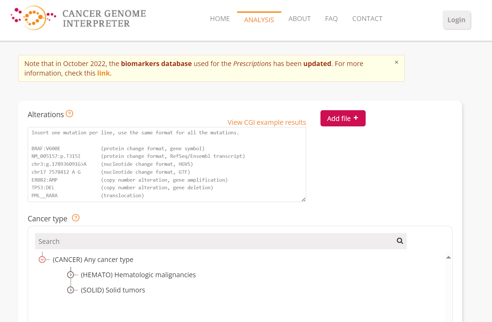

Clicking on the Add File button will allow upload of the CRUX-formatted
dataset. For this THCA dataset note the reference genome is hg19; this
is selected and Run button pressed [screenshot 22].

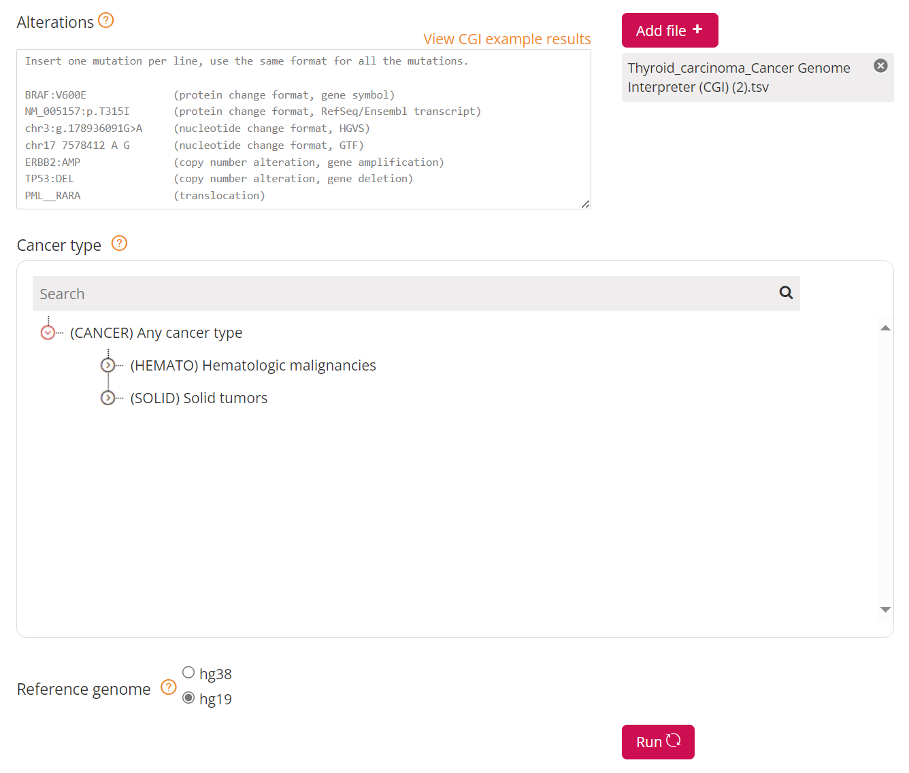

The job will start running (this will take some minutes) and the
progress bar will resemble screenshot 23.

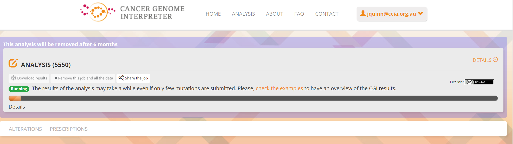

Processed data can be downloaded from the site. There will be a
configurable table of patient samples, as seen in screenshot 24 for the
initial view of the ALTERATIONS tab. Note the ‘drivers’ indicated under
Oncogenicity.

.. image:: ../images/manuscript_screenshots/study3/media/image24.png
   :width: 6.20435in
   :height: 3.3087in

This table can be explored in various ways: gene of interest or sample
of interest can be selected, driver information obtained (clicking on
the driver buttons bring up the CGI boostDM tool) and annotation from
OncoKB, clinvar and CGI databases. These are selected by clicking on the
symbols in the Oncogenic annotation column. One example for BRAF is
shown in screenshot 25, which indicates the mutation is gain of
function.

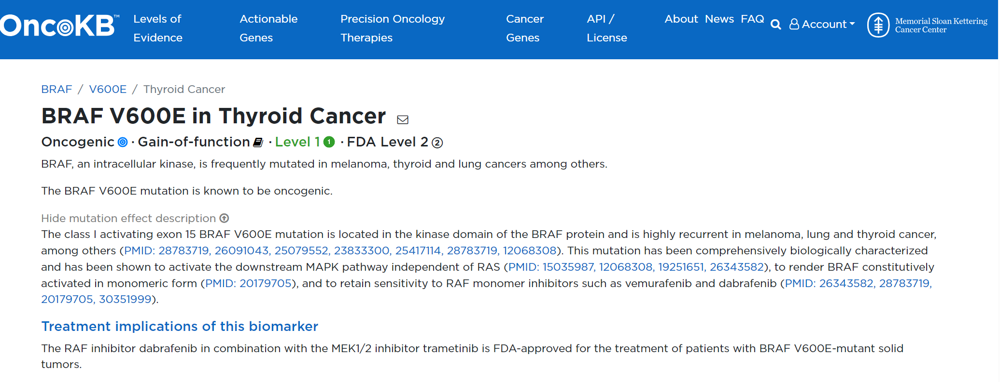

Examining TG gene mutations on the ALTERATIONS table, these are
confirmed as passenger mutations [screenshot 26]:

.. image:: ../images/manuscript_screenshots/study3/media/image26.png
   :width: 6.20435in
   :height: 1.95367in

The PRESCRIPTIONS tab results are shown in screenshot 27, giving
information on the drugs used in patient care and whether the mutations
make the cancer resistant or still responsive.

.. image:: ../images/manuscript_screenshots/study3/media/image27.png
   :width: 6.20435in
   :height: 2.91892in
