**Short study 5**

From: CRUX, a platform for visualising, exploring and analysing cancer
genome cohort data, by El-Kamand *et al*.

Please cite the above publication and the authors of any external tools
accessed using CRUX.

**Gene mutations associated with triple-negative breast cancer.**

*Dataset*: The TCGA Breast Invasive Carcinoma cohort dataset (n = 978)
including ductal and lobular carcinomas. The dataset is provided in
CRUX, with one modification: triple negative breast carcinoma samples
are labelled (under clinical feature
‘triple-negative_ER_PR_HER2_status’) for demonstration purposes, but
this subset can easily be constructed using subset and merge functions
under the utilities menu in the sidebar.

In this study we compare triple negative breast cancers (TNBC) against
the not-triple negative breast cancers (designated ‘not_TNBC’) to
identify mutations associated with these subtypes. Since this TCGA
dataset contains samples from male breast cancers these are first
filtered out, then then the sub-cohorts are constructed using the
‘subset’ utility; these two subtypes are then using the ‘Compare
cohorts’ function on the CRUX sidebar.

Under Utilities (CRUX sidebar) there is access to the Subset page
[screenshot 1]. The page has several panels to work through. First, on
Step 1 panel, clicking on the field will cause the available datasets
menu to drop down; the Breast Invasive Carcinoma dataset is then
selected.

.. image:: ../images/manuscript_screenshots/study5/media/image1.png
   :width: 6.22174in
   :height: 2.66957in

We then filter out ‘dubious genes’ (which commonly carry passenger
mutations) on the lower panel section [screenshot 2].

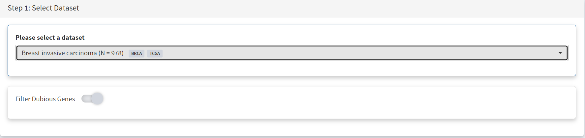

Then in Step 2 panel for our purposes we need to subset the data using a
clinical feature [screenshot 3].

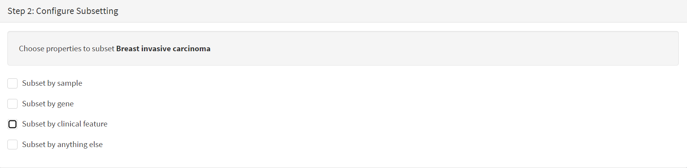

When clinical feature is checked, Field and Value menus become available
[screenshot 4]. These are drop down menus containing features available
to the user.

.. image:: ../images/manuscript_screenshots/study5/media/image4.png
   :width: 6.22174in
   :height: 2.26415in

Male breast cancer cases will be excluded here, so Field = ‘gender’ and
Value = ‘FEMALE’ are selected. These immediately give plots showing the
size of the subtypes [screenshot 5]; 966 famales and 9 males are shown.

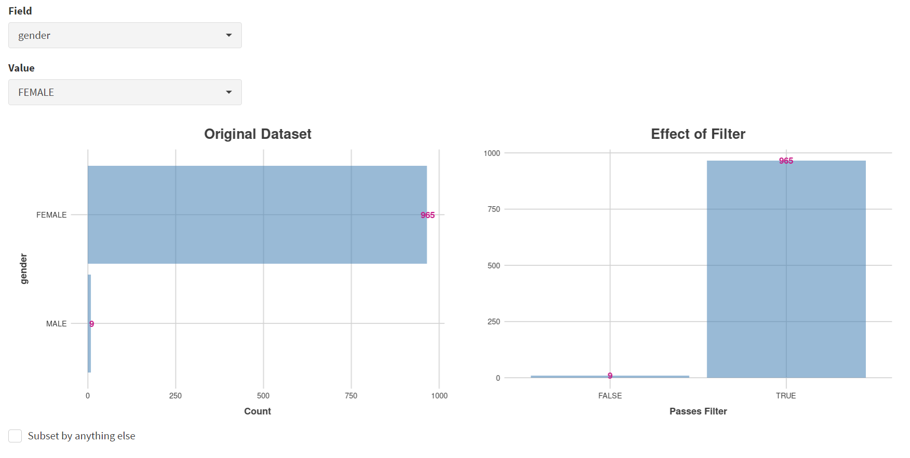

These female-only category needs to be named and entered as a CRUX
dataset for further use. This is shown in the Step 6 panel [screenshots
6 and 7].

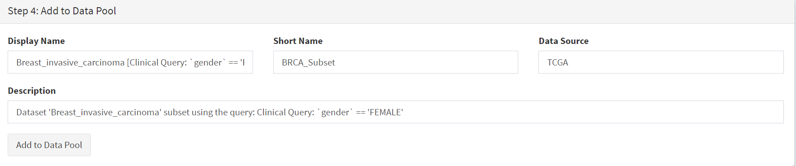

We simply name these ‘BRCAf’ [screenshot 7].

.. image:: ../images/manuscript_screenshots/study5/media/image7.png
   :width: 6.22174in
   :height: 1.54167in

Pressing the Add to Data Pool button beneath the fields brings pop-up
confirmation that the dataset has been imported [screenshot 8].

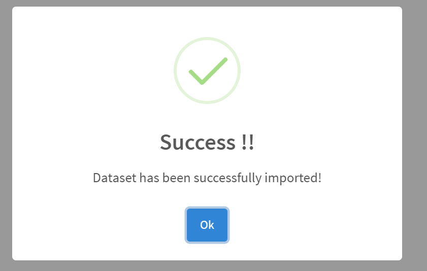

Returning to the top of the page to perform the second subsetting,
typing ‘brca’ in the selection field [screenshot 9] brings up the
original dataset (highlighted) but also the BRCAf dataset below it. Note
that the dataset is available but not saved for future use, so that if
CRUX is exited, it will need to be recreated to use.

.. image:: ../images/manuscript_screenshots/study5/media/image9.png
   :width: 6.22174in
   :height: 1.58333in

BRCAf is then selected, and Filter Dubious Genes turned on [screenshot
10].

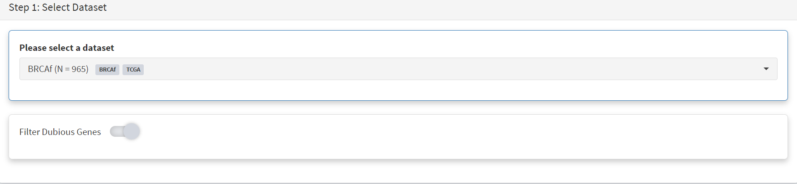

Next the subsetting of BRCAf is configured using Field=
‘triple_negative_ER-PR_HER2_subtype’ and Value = ‘Not Triple Negative’
[screenshot 11]. Note this subtype field was added to the dataset for
this study, but in the manuscript work was created using the individual
clinical features:

Field= ‘breast_carcinoma_estrogen_receptor_status’, Value= Positive’, OR

Field= ‘breast_carcinoma_progesterone_receptor_status’, Value= Positive’
OR

Field= ‘lab_proc_her2_neu_immunohistochemistry_receptor_status’, Value=
Positive’.

These subsets were merged using the CRUX ‘merge’ Utility, equivalent to
OR function.

.. image:: ../images/manuscript_screenshots/study5/media/image11.png
   :width: 6.22174in
   :height: 4.30556in

Note that only one subset at a time is created using this subset
utility. This is because there are often cancer samples with
intermediate (above, Ambiguous) and undocumented (‘NA’) Values that we
usually wish to ignore or analyse separately. For many of the Values, if
it is required to include more that one Value of cancer, more than on
can be selected. Also note that since there may be missing Clinical
Feature fields for some samples, the number of cancer samples in the
subtypes may sum to less that total samples in the dataset.

This subset needs to be given a name (we ues ‘not_TNBC’ here) in the
Step 4 panel [screenshot 12] and the Add to Dataset button pressed. The
pop up alert (not shown) confirms the sub-cohort is available.

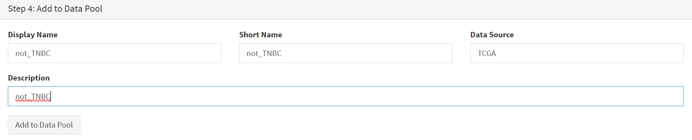

Then, the process is repeated to create the triple negative dataset
(TNBC) from the samples in the BRCAf set, starting at the first panel
[screenshot 13].

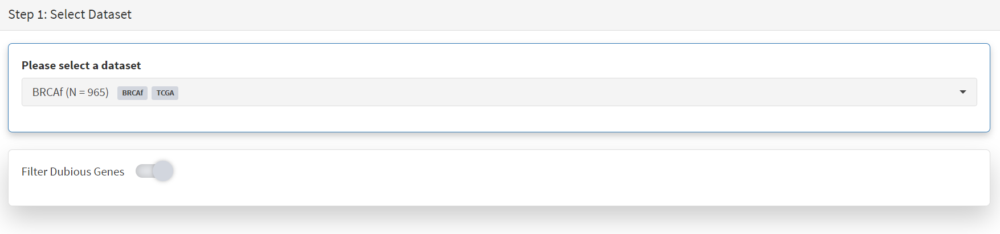

The subsetting is repeated as before, using using Field=
‘triple_negative_ER-PR_HER2_subtype’ and Value = ‘Triple Negative’
[screenshot 14]. In the manuscript work we employed:

Field= ‘breast_carcinoma_estrogen_receptor_status’, Value= Negative, AND

Field= ‘breast_carcinoma_progesterone_receptor_status’, Value= Positive’
AND

Field= ‘lab_proc_her2_neu_immunohistochemistry_receptor_status’, Value=
Positive’.

These subsets were sequentially subsetted using the CRUX ‘subset’
Utility, which gives the same result as an AND function.

.. image:: ../images/manuscript_screenshots/study5/media/image14.png
   :width: 6.26806in
   :height: 3.81944in

Then giving the subset a name [screenshot 15] and add to the Data pool.

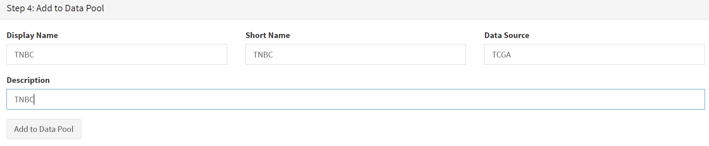

Subsets not_TBBC and TNBC can then be compared with the Compare Cohorts
function in the sidebar [screenshot 16].

.. image:: ../images/manuscript_screenshots/study5/media/image16.png
   :width: 6.26806in
   :height: 2.72917in

Comparison data is obtained using the Step 3 panel, first a tabular
summary [screenshot 16]; top of table only is shown.

.. image:: ../images/manuscript_screenshots/study5/media/image17.png
   :width: 6.26806in
   :height: 2.36806in

The next data to view is on the Rainforest Plot Summary tab [screenshot
17]. Note that the data is provided as an odds ratio; until recently
these tools returned log odds ratio. This screenshot is shown with the
FDR< 0.05 selection of the genes of interest. Note P-value column ‘***’
indicates a p-value <0.001.

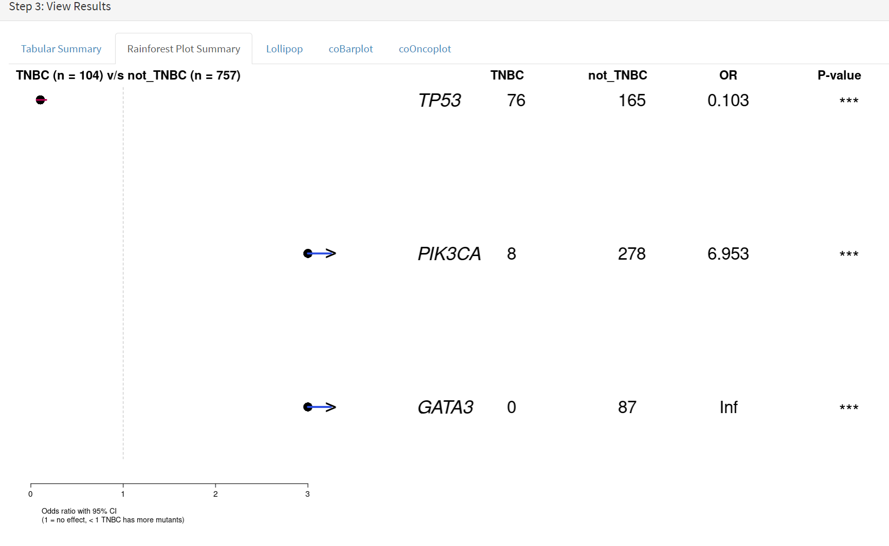

Selection of significant threshold is shown in screenshot 18.

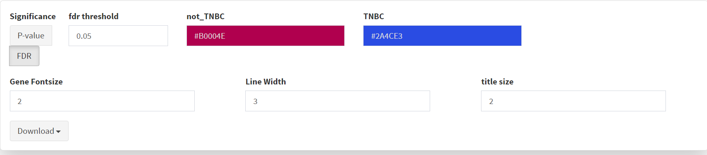

If we select threshold of p-value of 0.001 (not FDR), the results are
shown in screenshot 19.

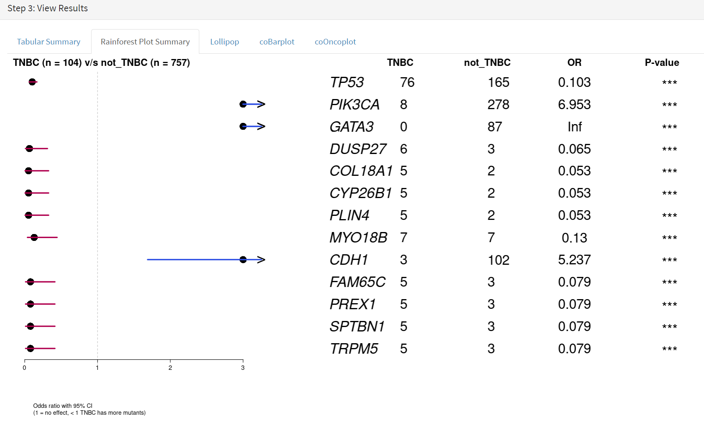

The mutations of a specific gene can be compared between TNBC and
not_TNBC sub-cohorts [screenshot 20] in the Lollipop tab; gene *PIK3CA*
is selected from the drop down menu below.

.. image:: ../images/manuscript_screenshots/study5/media/image22.png
   :width: 6.26806in
   :height: 4.32639in

The coBarplot tab gives a comparison of gene mutation frequencies
[screenshot 21]. Here, the TNBC frequencies go to the left and not_TNBC
go to the right, ie.e., showing two horizontal plots both with ‘0%’ as
the baseline. The types of mutations are indicated by colour bands, with
the key below the plot. This plot can be downloaded using the button
below.

.. image:: ../images/manuscript_screenshots/study5/media/image23.png
   :width: 6.26806in
   :height: 3.69444in

Lastly, side by side oncoplots are shown on the coOncoplot tab
[screenshot 21]. The samples are on the X-axis but ordered according
mutation occurrence and co-occurrence frequencies. Note that the
not_TNBC plot is wider as it contains far more samples.

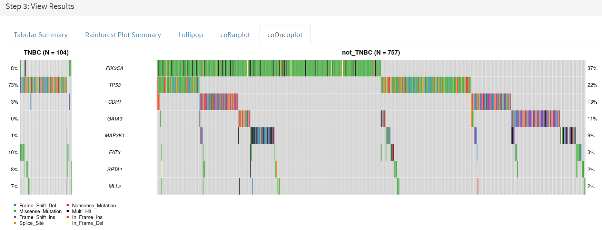
