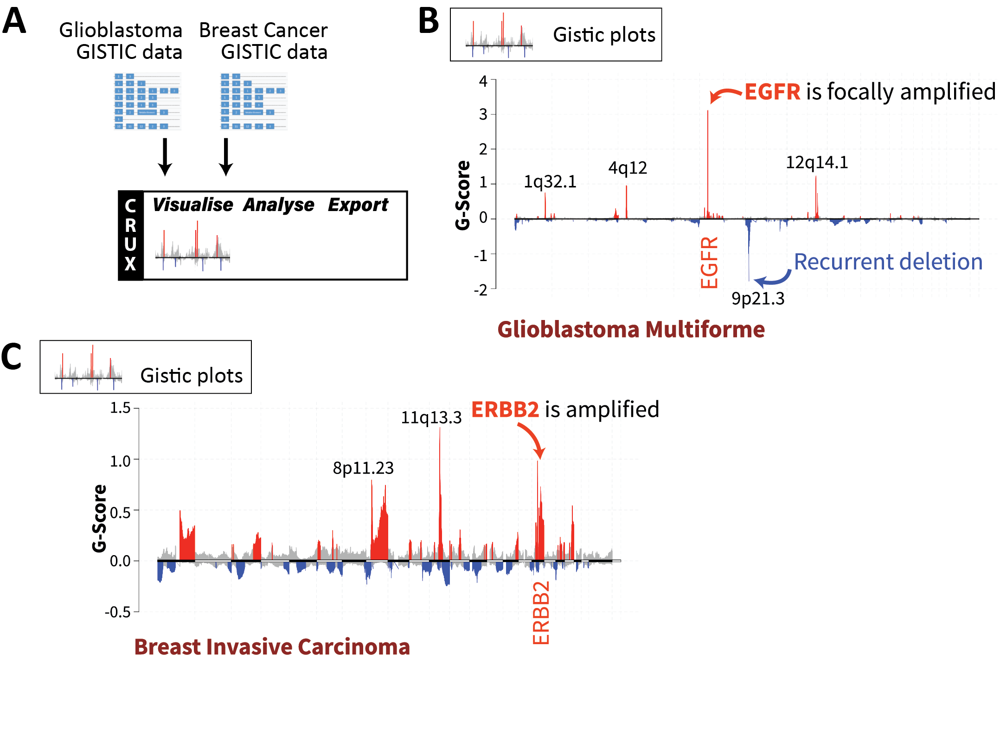

================================================================
New and Additional Studies
================================================================

This appendix describes further short studies beyond those presented in the
original CRUX manuscript that highlights other functions of CRUX

Original CRUX manuscript: 
   CRUX, a platform for visualising, exploring and analysing cancer
   genome cohort data, by El-Kamand *et al*.

-----------------------------------------------------------------------------
Identifying key copy number variants (CNVs) in a tumour cohort dataset
-----------------------------------------------------------------------------

*Rationale*: Somatic CNVs are a hallmark of many tumours, driving
large-scale numerical differences in DNA, resulting in alterations to
gene dosage and expression. GISTIC2 is a well-established tool for
assessing the CNV landscape of a cancer cohort, identifying genomic
regions harbouring recurrently amplified and deleted genes. CRUX can use
GISTIC2 processed data (which are publicly available for TCGA datasets)
to visualise CNV and add clinical detail annotations for further
interactive explorations. To keep CRUX lightweight and easy to install,
CRUX does not run GISTIC2 itself, and instead offers pre-compiled
GISTIC2 data for TCGA cohorts. For researchers wishing to generate
GISTIC2 results on their cohort, we recommend using GenePattern
(available online at
`www.genepattern.org <http://www.genepattern.org>`__).

*Dataset*: Inbuilt TCGA GISTIC2 results for both GBM (n = 273 with
matched WGS) and breast carcinoma (n=960 with matched WGS) were used.

*Analysis and Observations*: Here, the TCGA GISTIC2 data was imported
into CRUX, then the GISTIC-Plot module was used to create tabulated
summaries and data visualisations highlighting potentially important
CNVs (Supplementary Fig. S1A). The chromplot visualisation
(Supplementary Fig. S1B) revealed the highest G-Score peak, a measure of
CNV amplitude and recurrence, which corresponded to *EGFR* amplification
in GBM; the second strongest CNV signal was a deletion in the
*CDKN2A*-containing 9p21 region. Four other smaller peaks were noted
with G-scores between +0.5 and +2. An analysis of the TCGA breast
carcinoma cohort CNV data showed strong signals of *HER2* / *ERBB2*
amplification, well described in breast carcinoma (Supplementary Fig.
S1C).

*Outcomes*: CRUX visualised several CNV events that are known drivers of
cancer development, including CNVs affecting *EGFR* in GBM and *ERBB2*
(HER2) in breast cancers.

   **Figure S1. Cohort-level visualisation of copy number alterations from
   GISTIC2 results using CRUX.** (A) Integration of CNV data from TCGA
   glioblastoma (GBM) and TCGA breast carcinoma (BRCA). Inbuilt GISTIC2
   datasets for the TCGA GBM and BRCA cohorts were selected, leading to
   automatic generation of ‘chromplot’ visualisations. These are plots of
   the G-Scores (a metric integrating CNV recurrence and amplitude) which
   indicate the likely importance of CNVs in a cohort. (B) Selecting the
   GBM cohort in CRUX produced visualisations showing peaks corresponding
   to the characteristic EGFR amplification. (C) Visualisation of invasive
   breast carcinoma CNV data reveals peaks that notably correspond to HER2
   / ERBB2 as well as 11q13.3 amplification, which contains driver genes
   such as CCND1 and EMS1.
