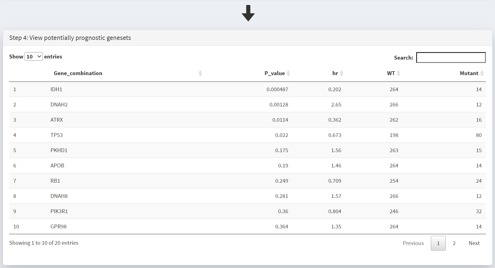
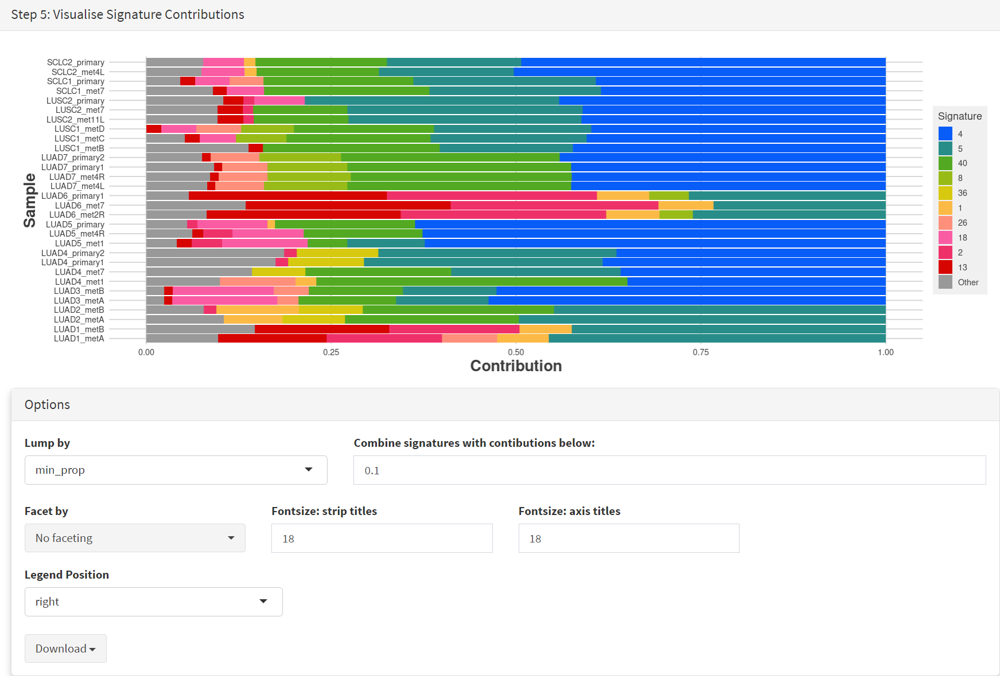
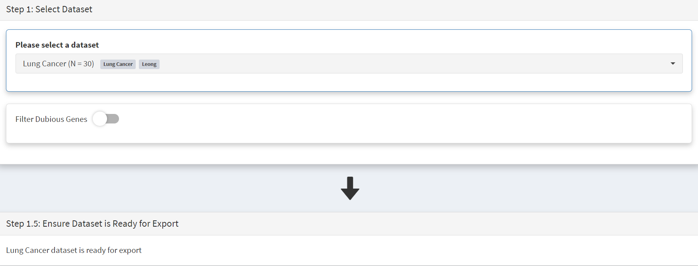
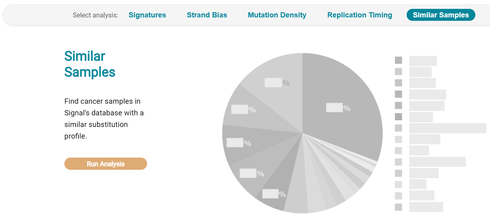
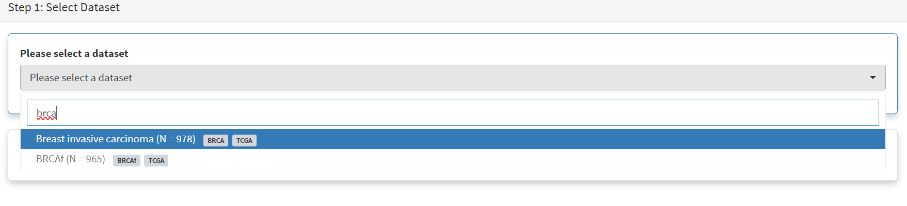

.. role:: red-title
   :class: red-title

############################################
Appendix
############################################

================================================================
Recreating analyses from the CRUX manuscript
================================================================

This appendix demonstrates how to perform each analysis from the manuscript:

CRUX, a platform for visualising, exploring and analysing cancer
genome cohort data, by El-Kamand *et al*.

Please cite the above publication and the authors of any external tools
accessed using CRUX.

----------------------------------------------------------------
Short study 1: Driver Identification
----------------------------------------------------------------
**Identify putative driver oncogenes from glioblastoma multiforme (GBM) tumours.**

A video tutorial recreating this study is available `here <https://www.youtube.com/channel/UCz3A5pNZOTjR5vrD-pR26qg>`_

----------------------------------------------------------------
Short study 2: Prognostic Biomarkers 
----------------------------------------------------------------

**Identify biomarkers associated with patient survival by integrating
genome molecular alterations with clinical data.**

Dataset: The inbuilt GBM cohort dataset (n = 283) from TCGA, as in short
study 1.

Here we study how patient survival in the GBM cohort relates to
mutations in genes of interest. The first step is to access the Survival
Analysis page, which is available under the Single Cohort Genomics menu
on the Crux sidebar [screenshot 1].

.. figure:: ../images/manuscript_screenshots/study2/media/image1.png
   :red-title:`Screenshot 1`

On this page the GBM dataset is selected and loaded. In the Step 1
panel, ‘glioblastoma’ entered in the selection field brings up the
Glioblastoma multiforme dataset, which is then selected. The Filter
Dubious Genes is also selected on that panel. In the Step 2 panel the
Time To Event dropdown menu is selected and option
‘days_to_last_followup’ chosen. From the Event Status dropdown menu
‘vital_status’ option is chosen. These two options delineate the time to
event needed for the patients of this GBM dataset.

Further filtering of the geneset can be performed on Step 3 panel
[screenshot 2], changing these filter values can greatly affect the
output table:

-  ’Only consider the top N genes’ filter - genes are ranked by number
   of samples bearing mutations in them, and removes all genes outside
   the top N highly ranked genes. These N genes are passed to the table.
   Note that the table does not use this ranking as it ranks by hazard
   ratio p-value.

-  ‘Geneset size’ filter – setting this to 1 (default) looks at genes
   individually, while setting to 2 means that pairs of genes are
   examines, so that samples with mutations in a pair of 2 genes (such
   as *TP53* and *RB1*) are considered and compared to other gene pairs.

-  ‘Minimum size’ filter – excluded genes that show mutations in fewer
   than this number of samples.

Changing these filters can greatly alter the genes included in the table
in screenshot 3. It is also important to remove genes with many
passenger mutations using the filter dubious genes button.

   
   :red-title:`Screenshot 2`

This populates the Step 4 panel with a list of genes ordered by the
p-value of the survival hazard ratio, comparing survival of patients
that have mutations in a specific gene with patients that do not.
Screenshot 3 shows the data for from the top 10 genes in GBM, with
*IDH1* mutations (p-value of 0.000487) at the top of the list. The
hazard ratio of 0.202 is well below 1, indicating much better survival
of these patients than those without *IDH1* mutations. Note that only 14
patients have *IDH1* mutations. None of the genes beyond TP53 show
p-value less than 0.05 .

   :red-title:`Screenshot 3`

Screenshot 4 shows the next 10 genes on this list; the top 20 genes were
selected. Note that in the CRUX manuscript (Fig. 3). Note that in the
manuscript gene *STAG2* was included in the table as the top N gene
filter was set to 40, and *STAG2* is mutated in only 12 samples; this is
an example of the effects of changing this filter number.

   :red-title:`Screenshot 4`

Plotting of survival information for a gene is performed on the Step 5
panel. To examine *IDH1* mutations this gene is selected under the
Select Genest menu [screenshot 6].

.. figure:: ../images/manuscript_screenshots/study2/media/image5.png

   :red-title:`Screenshot 5`
   
This selection produces a Kaplan Meier plot in the Step 6 Visualisation
panel [screenshot 7]. Note that the gene (or genes) selected are
labelled as ‘Geneset’ and are compared to ‘WT’, i.e., no mutation. More
than one gene can be selected so that the effects of gene mutation
combinations can be explored.

.. figure:: ../images/manuscript_screenshots/study2/media/image6.png

   :red-title:`Screenshot 6`
   
This plot can be downloaded for use using the Download button as seen in
screenshot 8.

   
   :red-title:`Screenshot 7`

Next to identify the mutations of interest we move to the Lollipop and
select the GBM dataset, as shown in screenshot 9.

   
   :red-title:`Screenshot 8`

This gives the Lollipop plot for the selected gene. Screenshot 10 shows
the consequences of the mutation for the protein (and defined protein
domains), one the Step 2 panel. Here *IDH1* was selected in the lower
part of the panel under the Gene menu [screenshot 11]. For this gene it
is notable that mutations are only seen at one site corresponding to
amino acid 132.

.. figure:: ../images/manuscript_screenshots/study2/media/image9.png
   
   :red-title:`Screenshot 9`

   
   :red-title:`Screenshot 10`

----------------------------------------------------------------
Short study 3: Therapeutic Relevance of Driver Mutations
----------------------------------------------------------------

**Identification of candidate driver mutations linked to therapeutic
responses in thyroid cancer.**

Dataset: The Thyroid Cancer (THCA) dataset, containing data (MAF file)
generated from whole genome sequencing for 496 patient samples.

For this study the first step from the CRUX homepage is to select and
load the thyroid carcinoma dataset. This is available from ‘Available
Data’ under the Data menu on the homepage sidebar or the Explore Public
Datasets button in the ‘Getting Started’ homepage panel. The thyroid
carcinoma dataset (THCA) dataset is brought up by typing ‘thyroid’ in
the name field [screenshot 1] or THCA into the abbreviation field.

   :red-title:`Screenshot 1`

Clicking on the dataset 28 ‘Thyroid_carcinoma’ button opens the next
page; the Filter Dubious Genes button on Step 1 panel [screenshot 2] is
selected.

.. figure:: ../images/manuscript_screenshots/study3/media/image2.png
   
   :red-title:`Screenshot 2`

Below this in the Step 2 panel there are the Explore Visualisation tabs
[screenshot 3]. Here we use the Oncoplot tab to examine the genes with
mutations occurring in the largest number of samples. The standout gene
is *BRAF*, although *NRAS*, *HRAS, FAM47C* and *TG* are also notable.
The *NRAS* and *HRAS* are known oncogenes, *FAM47C* is a poorly
understood but widely expressed gene, while *TG* is a significant THCA
marker (encoding the thyroglobulin protein produced by thyroid tissue)
which may not be oncogenic.

   
   :red-title:`Screenshot 3`

**Use of OncoDriveCLUSTL tool**.

OncoDriveCLUSTL is an external platform for gene driver analysis. This
is accessed using the External Tools button on the CRUX sidebar. On the
page that opens, the first step is to select the THCA dataset for
download at the Step 1 panel, as shown in screenshot 4.

.. figure:: ../images/manuscript_screenshots/study3/media/image4.png
   
   :red-title:`Screenshot 4`

Then Filter Dubious Genes is selected [screenshot 5].

.. figure:: ../images/manuscript_screenshots/study3/media/image5.png
   
   :red-title:`Screenshot 5`

Below this is the Step 1.5 panel, where CRUX should indicate the THCA
dataset is ready for export. In the step 2 panel there is the Select
Tool tab. Usually it has the first tool (OncodriveFML) highlighted but
when clicked on the menu drops down and OncoDriveCLUSTL can be selected
[screenshot 6]

.. figure:: ../images/manuscript_screenshots/study3/media/image6.png
   
   :red-title:`Screenshot 6`

Moving to the Step 3 panel [screenshot 7], clicking on the Export Data
tab and will download the formatted THCA dataset to the user computer,
ready to upload to the OncoDriveCLUSTL platform. On the Step 4 panel,
clicking on the blue button opens a new browser window for
OncoDrivCLUSTL, at
http://bbglab.irbbarcelona.org/oncodriveclustl/analysis :

.. figure:: ../images/manuscript_screenshots/study3/media/image7.png
   
   :red-title:`Screenshot 7`

On the Step 5 panel (not shown) there are instructions and information
on the tool. To use OncoDriveCLUSTL a BBGlab account needed (this is
rapidly done and is free) to log in to use the tool. As seen in
screenshot 8]. Give the analysis run a name then upload the THCA file
prepared by CRUX.

   
   :red-title:`Screenshot 8`

After checking the terms of use button and press submit a process
progress window opens; screenshot 9 was taken shortly after starting a
data processing run.

.. figure:: ../images/manuscript_screenshots/study3/media/image9.png
   
   :red-title:`Screenshot 9`

The data processing may take some time, over 15 minutes for this
dataset. The window will show the status indicator as ‘Finished’, and a
plot appears [screenshot 10] showing putative drivers with observed
versus expected p-values.

.. figure:: ../images/manuscript_screenshots/study3/media/image10.png
   
   :red-title:`Screenshot 10`

This indicates that *BRAF*, *NRAS*, *HRAS* and *FAM47C* mutations (seen
in Oncoplot) are highly selected for standout candidates to be examined.
Note that *TG* is not seen.

In the next part of the study we examine *BRAF* mutations.

**Use of cBioPortal mutation mapper tool**

As above the External tools tab is selected from the CRUX home page, the
THCA data is selected, Filter Dubious Genes selected and cBioPortal
mutation mapper selected in the Step2 panel, as in screenshot 11.

   
   :red-title:`Screenshot 11`

We then need to select the gene, *BRAF*, in the Step 3 panel [screenshot
12].

   :red-title:`Screenshot 12`

Data is then ready for download (indicated in step 1.5) using the
‘Export Data’ button on the Step 3 panel [screenshot 13]. Using the
button on the Step 4 panel will open a window for the cBioportal
Mutation Mapper at https://www.cbioportal.org/mutation_mapper .

.. figure:: ../images/manuscript_screenshots/study3/media/image13.png
   
   :red-title:`Screenshot 13`

Signup for a BBGLab account may be required. The cBioportal Mutation
Mapper window is shown in screenshot 14. After login, the downloaded
file can be chosen, genome standard (GRCH37) selected, and visualisation
selected at the bottom, as on screenshot 15.

.. figure:: ../images/manuscript_screenshots/study3/media/image14.png
   
   :red-title:`Screenshot 14`

   
   :red-title:`Screenshot 15`

A plot is returned, shown in screenshot 16.

   
   :red-title:`Screenshot 16`

This indicates the gene domains and the presence of mutations, as well
as the mutation types and their annotations from OncoKB and others. A
plot with the mutation detail shown in screenshot 17.

.. figure:: ../images/manuscript_screenshots/study3/media/image17.png
   
   :red-title:`Screenshot 17`

Further details of cohort mutations can be added, screenshot 18, using
the ‘Add annotation tracks’ button, seen in screenshot 18. A 3D protein
structure graphic showing the affected domain can also be obtained (not
shown).

   
   :red-title:`Screenshot 18`

**Use of Cancer Genome Interpreter (CGI) tool**

After navigating to the External tools on the home page, the CGI tool Is
selected, screenshot 19.

.. figure:: ../images/manuscript_screenshots/study3/media/image19.png
   
   :red-title:`Screenshot 19`

Dataset is selected and downloaded [screenshot 20] as described
previously.

   
   :red-title:`Screenshot 20`

Clicking on the navigation button in the Step 4 panel opens a new
browser window for the CGI portal [screenshot 21] at
https://www.cancergenomeinterpreter.org/analysis; an account (easily
obtained and free) is needed for login. If not logged in the tool can
work, but it is likely that there will be a pink box at the bottom
indicating ‘you have exceeded the maximum number of jobs’. Log in will
make the user’s previous analyses from the previous 6 month the
available.

The ANALYSIS tab should be open for the next step.

.. figure:: ../images/manuscript_screenshots/study3/media/image21.png
   
   :red-title:`Screenshot 21`

Clicking on the Add File button will allow upload of the CRUX-formatted
dataset. For this THCA dataset note the reference genome is hg19; this
is selected and Run button pressed [screenshot 22].

.. figure:: ../images/manuscript_screenshots/study3/media/image22.png
   
   :red-title:`Screenshot 22`

The job will start running (this will take some minutes) and the
progress bar will resemble screenshot 23.

.. figure:: ../images/manuscript_screenshots/study3/media/image23.png
   
   :red-title:`Screenshot 23`

Processed data can be downloaded from the site. There will be a
configurable table of patient samples, as seen in screenshot 24 for the
initial view of the ALTERATIONS tab. Note the ‘drivers’ indicated under
Oncogenicity.

   
   :red-title:`Screenshot 24`

This table can be explored in various ways: gene of interest or sample
of interest can be selected, driver information obtained (clicking on
the driver buttons bring up the CGI boostDM tool) and annotation from
OncoKB, clinvar and CGI databases. These are selected by clicking on the
symbols in the Oncogenic annotation column. One example for BRAF is
shown in screenshot 25, which indicates the mutation is gain of
function.

.. figure:: ../images/manuscript_screenshots/study3/media/image25.png
   
   :red-title:`Screenshot 25`

Examining TG gene mutations on the ALTERATIONS table, these are
confirmed as passenger mutations [screenshot 26]:

   
   :red-title:`Screenshot 26`

The PRESCRIPTIONS tab results are shown in screenshot 27, giving
information on the drugs used in patient care and whether the mutations
make the cancer resistant or still responsive.

   
   :red-title:`Screenshot 27`

------------------------------------------------
Short study 4: Mutational Signatures
------------------------------------------------

**Mutation signature analysis of cohort data.**

*Dataset*: We created a new dataset in CRUX by importing published
variant calls from a previous study of 30 lung tumours sequenced with
deep multi-region whole genome sequencing (WGS), merging this with the
associated clinical data. These data are from Leong et al 2019,
manuscript reference 24 (PMID: 30348992) and is available from European
Nucleotide Archive (https://www.ebi.ac.uk/ena) accession number
PRJEB28616. The patients included current, former, and non-smokers, and
the tumour biopsies were from paired primary and metastatic tumour
biopsies. The data was in VCF file format, which we annotated using a
command line vcf2maf tool available at https://github.com/mskcc/vcf2maf
to create the MAF files employed here. Further clinical annotation used
data (CSV filetype) on patient smoking status.

In this study we examine somatic variant signatures in lung cancer data.
These signatures are patterns of single nucleotide mutations which can
provide mutagenesis mechanisms and other information regarding tumour
development; the signatures used are COSMIC V3. Analysis employed two
external tools, Mutalisk (http://mutalisk.org/analyze.php) and Signal
(https://www.signaldb.org/). For this work MAF files are first uploaded,
then the additional clinical data (smoking status of participants);
these are merged an loaded into CRUX.

From the Import Data selection (under the Data menu on the CRUX
sidebar), a panel opens as seen is screenshot 1. After selecting MAF
filetyping in Step 1 panel, the relevant MAF file was chosen was located
using the Browse button in Step 2 panel then uploaded.

   
   :red-title:`Screenshot 1`

The additional clinical annotations file was similarly located, selected
and uploaded from the STEP 2 panel [screenshot 2].

.. figure:: ../images/manuscript_screenshots/study4/media/image2.png
   
   :red-title:`Screenshot 2`

In the Step 4 panel the files were then given the name (‘Lung Cancer’)
that they will carry when loaded in CRUX. The Import button (blue) was
then pressed [screenshot 3

.. figure:: ../images/manuscript_screenshots/study4/media/image3.png
   
   :red-title:`Screenshot 3`

Import to CRUX was confirmed after 20 second delay [screenshot 4].

.. figure:: ../images/manuscript_screenshots/study4/media/image4.png
   
   :red-title:`Screenshot 4`

Selecting the External Tools (CRUX sidebar) opens a page where the
dataset is chosen [screenshot 5]. Note that the Dubious Genes filter is
not selected as the passenger mutations in these genes are required for
the signature analyses.

.. figure:: ../images/manuscript_screenshots/study4/media/image5.png
   
   :red-title:`Screenshot 5`

In the External Tools Step 2 panel ‘Mutalisk’ is selected, and the data
exported at Step 3; this arrives in the computer download folder as a
zipped folder called ‘Lung Cancer_Mutalisk’, the dataset name in CRUX.
This contains VCF data files for all the samples, and it is best to open
the folder and copy the uncompressed files to a nearby location. These
individual files will be uploaded to Mutalisk as described below.

Note that in the Step 5 panel there is information about using Mutalisk:

Instructions

1. Unzip exported file

2. Click 'Upload Files' and select all samples you want to run signature
   analysis on

3. Select reference build (Human GRCh37 if using pre-packaged TCGA/PCAWG
   datasets)

4. Select the relevant Disease Type mutalisk will automatically choose
   relevant signatures to screen in sample. An alternate unbiased
   approach is to screen against all PCAWG (V3) signatures. To do this
   expand the PCAWG tab and 'select all' signatures. You do not need to
   specify a disease.

5. Run analysis

Next press the Go to Mutalisk button selected in Step 4 panel.

   
   :red-title:`Screenshot 6`

CRUX then opens a browser window running Mutalisk [screenshot 7].

.. figure:: ../images/manuscript_screenshots/study4/media/image7.png
   
   :red-title:`Screenshot 7`

However, the ‘COSMIC’ signatures are not the most up to date. To select
the correct type of COSMIC V3 signatures it is necessary to select the
PCAWG – Sig profiler option below it. Then the signature types to be
examined are designated using the Select all button [screenshot 8].

   
   :red-title:`Screenshot 8`

Then the +Add Files option is pressed, the files exported from CRUX are
chosen (unzipped) and the files are processed [screenshot 9]. The RUN
button is then pressed and the analysis proceeds as indicated. Note that
this processing is slow and can take several hours for 30 samples. The
initial stage of processing is shown in screenshot 9. Mutalisk gives a
process number so the user can exit and return to see progress later.

.. figure:: ../images/manuscript_screenshots/study4/media/image9.png
   
   :red-title:`Screenshot 9`

Mutalisk then outputs a number of analyses for each dataset input. Some
of these are in downloaded PDF files; examples for LUAD1 are shown in
screenshots 10 to 13. For example, screenshots 10 and 11 show kataegis
analysis output for LUAD1 and LUAD7, respectively, showing a
predominance of C>A mutations in the latter but not the former.

.. figure:: ../images/manuscript_screenshots/study4/media/image10.png
   
   :red-title:`Screenshot 10`

.. figure:: ../images/manuscript_screenshots/study4/media/image11.png
   
   :red-title:`Screenshot 11`

Screenshot 12 shows the Mutalisk signature output from sample
LUAD7_primary1, a primary lung tumour showing a typical smokers profile
with high SBS4. Highlighted (blue line) is the signature plot presented
in El-Kamand et al Figure 5C (recoloured for clarity). The signature
proportion varies slightly over time as the signature data is updated in
the Mutalisk portal.

   
   :red-title:`Screenshot 12`

Screenshot 13 shows the Mutalisk signature output from sample
LUAD1_metA, a lung tumour metastasis showing a non-typical smokers
profile no detectable SBS4. Signature plot is highlighted (blue line) in
El-Kamand et al Figure 5C (recoloured for clarity).

.. figure:: ../images/manuscript_screenshots/study4/media/image13.png
   
   :red-title:`Screenshot 13`

However, for cohort wide analysis we need to load the Mutalisk data into
CRUX. At the top of the Mutalisk page the ‘Get the selected result for
all samples a once’ button is pressed [screenshot 14, red line
highlight].

   
   :red-title:`Screenshot 14`

This downloads a zip file with a filename ending in ‘.all.samples.zip’.
The next step uses these files downloaded from Mutalisk, which are first
unzipped files and placed in an accessible folder for CRUX to navidgate
to; example files from a containing folder shown in screenshot 15. CRUX
will ignore the PDF files.

   
   :red-title:`Screenshot 15`

When the Mutalisk files are ready, the Mutational Signatures tab (under
the Single Cohort Genomics menu located on the CRUX sidebar) is then
selected to open a new page of panels [screenshot 16]. On the first
(Step 1) panel the Lung Cancer data is selected using the ‘Please select
a dataset’ field. Then on the Step 2 panel the instructions given in the
panel have already been followed by this point, so the the next action
is to press the Browse button, and navigate to where the unipped
Mutalisk files are located. Those files are selected and opened by CRUX,
which may take a minute. When finished the blue ‘Upload Complete’ bar
should appear below.

.. figure:: ../images/manuscript_screenshots/study4/media/image16.png
   
   :red-title:`Screenshot 16`

The next panels should then be visible. Step 3 panel shows a Venn
diagram indicating that the MAF and Mutalisk data match up [screenshot
17]. Note that the Filter Dubious Genes option is off.

   
   :red-title:`Screenshot 17`

The Step 4 panel (Review Tabular Data) contains the data table,
including the signature variants and their contributions for each
sample; part of the table is shown on screenshot 18 with some details
blanked. This data can be subsetted and searched but is more easily
comprehended in the next Step.

.. figure:: ../images/manuscript_screenshots/study4/media/image18.png
   
   :red-title:`Screenshot 18`

The Step 5 panel [screenshot 19] shows the visualisation of the
signature contributions (X-axis) for each tissue sample. There are
multiple tissue samples (tumour primary samples and metastasis samples)
for comparison. Note that colours are set by Mutalisk, so in the
El-Kamand et al manuscript the chart colours have been adjusted for
clarity.

   
   :red-title:`Screenshot 19`

Pressing the Download button at the bottom brings up the download
options shown in screenshot 20.

.. figure:: ../images/manuscript_screenshots/study4/media/image20.png
   
   :red-title:`Screenshot 20`

Next further signature analysis can be performed using the external
Signal tool with the Lung cancer data loaded into CRUX as above.

As for Mutalisk above, we first navigate to the External tool tab on the
sidebar and open that page. In the Step 1 panel the Lung Cancer dataset
is selected [screenshot 21]

   
   :red-title:`Screenshot 22`

On the Step 2 panel the Signal tool is selected [screenshot 22] and the
data for export is downloaded using the Export Data button. Note again
that the Filter Dubious genes is off, since for signature analysis we
are not concerned with gene drivers but the general pattern of mutations
present compared to those seen in other cancers.

.. figure:: ../images/manuscript_screenshots/study4/media/image23.png
   :red-title:`Screenshot 23`

The filename zipped file provided is ‘Lung cancer_Signal.zip’. As
described in the Step 5 panel, unzip the file (‘signal_input1.txt’) and
navigate to the Signals portal
(https://signal.mutationalsignatures.com/analyse2).

The blue Go to Signal button is press and Signal website opens in a new
browser screen, as shown in screenshot 23.

   
   :red-title:`Screenshot 24`

The upload data button is then pressed, which opens the upload file page
[screenshot 24]. Here, the signal_input1.txt file from CRUX is uploaded
according to instructions.

.. figure:: ../images/manuscript_screenshots/study4/media/image25.png
   
   :red-title:`Screenshot 25`

When the file finishes upload the file format must be selected as
‘[Variants]/TSV/TXT’ as seen in the screenshot 25. The reference genome
build selected (here GRCh37) and the organ chosen, here LUNG.

.. figure:: ../images/manuscript_screenshots/study4/media/image26.png
   
   :red-title:`Screenshot 26`

When the analysis is done there are a number of panels that are used to
access the analysis of individual lung cancer datasets; the first six
shown in screenshot 26.

   
   :red-title:`Screenshot 27`

Here we are interested in tumours LUAD1_metA and LUAD7 primary1 used in
the El-Kamand et al manuscript. Clicking on the LUAD1_metA panel brings
a number of plots describing single nucleotide variants (SNV) types and
frequencies, and the proportion of COSMIC V23 signal seen in the variant
complement of this tumour. The first data shown is the Substitution
catalogue, the pattern of nucleotide substitutions in this tumour; this
is shown in screenshot 27.

.. figure:: ../images/manuscript_screenshots/study4/media/image28.png
   
   :red-title:`Screenshot 28`

There are a number of analyses we can perform from this page, listed at
the bottom, including strand bias, mutation density, replication timing
and similar samples. For each there is a text hyperlink at the bottom of
the page leading to the relevant page.

The Signatures analysis shows the relative preponderance of defined
COSMIC V3 signatures detected in the sample mutations [screenshot 28];
note that there are a range of other related visualisation provided on
this page.

   
   :red-title:`Screenshot 29`

The Similar Samples analysis is of particular interest as it can
indicate which type of tumours (available to this database) most
resemble the mutation patterns seen in this LUAD1 tumour. Screenshot 29
shows the Similar Samples data page.

   
   :red-title:`Screenshot 30`

Screenshot 30 shows the output when the analysis is run. The analysis is
run with a cosine threshold of 0.96 – the pie chart is similar to that
used in the El-Kamand manuscript figure 5D

.. figure:: ../images/manuscript_screenshots/study4/media/image31.png
   
   :red-title:`Screenshot 31`

This signature data suggests that the cancer LUAD1 has a pattern of
variant that most closely resembles that of Breast Cancer, and only
poorly matches Lung cancers.

Next is the analysis of the LUAD7_primary1 tumour, first showing the
substitution catalogue which can be seen to be very different to the
LUAD7 tumour [screenshot 31].

.. figure:: ../images/manuscript_screenshots/study4/media/image32.png
   
   :red-title:`Screenshot 32`

LUAD7 sample Signatures analysis (COSMIC V3 signatures) in this sample
is shown in screenshot 32. Note the prominent SBS4 smoking associated
signature, absent in LUAD1.

   
   :red-title:`Screenshot 33`

The Similar Sample analysis of LUAD7 sample greatly resembles Lung
cancers, unlike (again) LUAD1 [screenshot 33]. This may reflect a
preponderance of lung cancers in the Signal database that are caused by
smoking.

   
   :red-title:`Screenshot 34`

----------------------------------------------------------------
Short study 5: Comparing Virtual Cohorts
----------------------------------------------------------------

**Gene mutations associated with triple-negative breast cancer.**

*Dataset*: The TCGA Breast Invasive Carcinoma cohort dataset (n = 978)
including ductal and lobular carcinomas. The dataset is provided in
CRUX, with one modification: triple negative breast carcinoma samples
are labelled (under clinical feature
‘triple-negative_ER_PR_HER2_status’) for demonstration purposes, but
this subset can easily be constructed using subset and merge functions
under the utilities menu in the sidebar.

In this study we compare triple negative breast cancers (TNBC) against
the not-triple negative breast cancers (designated ‘not_TNBC’) to
identify mutations associated with these subtypes. Since this TCGA
dataset contains samples from male breast cancers these are first
filtered out, then then the sub-cohorts are constructed using the
‘subset’ utility; these two subtypes are then using the ‘Compare
cohorts’ function on the CRUX sidebar.

Under Utilities (CRUX sidebar) there is access to the Subset page
[screenshot 1]. The page has several panels to work through. First, on
Step 1 panel, clicking on the field will cause the available datasets
menu to drop down; the Breast Invasive Carcinoma dataset is then
selected.

   
   :red-title:`Screenshot 1`

We then filter out ‘dubious genes’ (which commonly carry passenger
mutations) on the lower panel section [screenshot 2].

.. figure:: ../images/manuscript_screenshots/study5/media/image2.png
   
   :red-title:`Screenshot 2`

Then in Step 2 panel for our purposes we need to subset the data using a
clinical feature [screenshot 3].

.. figure:: ../images/manuscript_screenshots/study5/media/image3.png
   
   :red-title:`Screenshot 3`

When clinical feature is checked, Field and Value menus become available
[screenshot 4]. These are drop down menus containing features available
to the user.

.. figure:: ../images/manuscript_screenshots/study5/media/image4.png
   
   :red-title:`Screenshot 4`

Male breast cancer cases will be excluded here, so Field = ‘gender’ and
Value = ‘FEMALE’ are selected. These immediately give plots showing the
size of the subtypes [screenshot 5]; 966 famales and 9 males are shown.

.. figure:: ../images/manuscript_screenshots/study5/media/image5.png
   
   :red-title:`Screenshot 5`

These female-only category needs to be named and entered as a CRUX
dataset for further use. This is shown in the Step 6 panel [screenshots
6 and 7].

.. figure:: ../images/manuscript_screenshots/study5/media/image6.png
   
   :red-title:`Screenshot 6`

We simply name these ‘BRCAf’ [screenshot 7].

   
   :red-title:`Screenshot 7`

Pressing the Add to Data Pool button beneath the fields brings pop-up
confirmation that the dataset has been imported [screenshot 8].

.. figure:: ../images/manuscript_screenshots/study5/media/image8.png
   
   :red-title:`Screenshot 8`

Returning to the top of the page to perform the second subsetting,
typing ‘brca’ in the selection field [screenshot 9] brings up the
original dataset (highlighted) but also the BRCAf dataset below it. Note
that the dataset is available but not saved for future use, so that if
CRUX is exited, it will need to be recreated to use.

   
   :red-title:`Screenshot 9`

BRCAf is then selected, and Filter Dubious Genes turned on [screenshot
10].

.. figure:: ../images/manuscript_screenshots/study5/media/image10.png
   
   :red-title:`Screenshot 10`

Next the subsetting of BRCAf is configured using Field=
‘triple_negative_ER-PR_HER2_subtype’ and Value = ‘Not Triple Negative’
[screenshot 11]. Note this subtype field was added to the dataset for
this study, but in the manuscript work was created using the individual
clinical features:

Field= ‘breast_carcinoma_estrogen_receptor_status’, Value= Positive’, OR

Field= ‘breast_carcinoma_progesterone_receptor_status’, Value= Positive’
OR

Field= ‘lab_proc_her2_neu_immunohistochemistry_receptor_status’, Value=
Positive’.

These subsets were merged using the CRUX ‘merge’ Utility, equivalent to
OR function.

   
   :red-title:`Screenshot 11`

Note that only one subset at a time is created using this subset
utility. This is because there are often cancer samples with
intermediate (above, Ambiguous) and undocumented (‘NA’) Values that we
usually wish to ignore or analyse separately. For many of the Values, if
it is required to include more that one Value of cancer, more than on
can be selected. Also note that since there may be missing Clinical
Feature fields for some samples, the number of cancer samples in the
subtypes may sum to less that total samples in the dataset.

This subset needs to be given a name (we ues ‘not_TNBC’ here) in the
Step 4 panel [screenshot 12] and the Add to Dataset button pressed. The
pop up alert (not shown) confirms the sub-cohort is available.

.. figure:: ../images/manuscript_screenshots/study5/media/image12.png
   
   :red-title:`Screenshot 12`

Then, the process is repeated to create the triple negative dataset
(TNBC) from the samples in the BRCAf set, starting at the first panel
[screenshot 13].

.. figure:: ../images/manuscript_screenshots/study5/media/image13.png
   
   :red-title:`Screenshot 13`

The subsetting is repeated as before, using using Field=
‘triple_negative_ER-PR_HER2_subtype’ and Value = ‘Triple Negative’
[screenshot 14]. In the manuscript work we employed:

Field= ‘breast_carcinoma_estrogen_receptor_status’, Value= Negative, AND

Field= ‘breast_carcinoma_progesterone_receptor_status’, Value= Positive’
AND

Field= ‘lab_proc_her2_neu_immunohistochemistry_receptor_status’, Value=
Positive’.

These subsets were sequentially subsetted using the CRUX ‘subset’
Utility, which gives the same result as an AND function.

   
   :red-title:`Screenshot 14`

Then giving the subset a name [screenshot 15] and add to the Data pool.

.. figure:: ../images/manuscript_screenshots/study5/media/image15.png
   
   :red-title:`Screenshot 15`

Subsets not_TBBC and TNBC can then be compared with the Compare Cohorts
function in the sidebar [screenshot 16].

   
   :red-title:`Screenshot 16`

Comparison data is obtained using the Step 3 panel, first a tabular
summary [screenshot 16]; top of table only is shown.

   
   :red-title:`Screenshot 17`

The next data to view is on the Rainforest Plot Summary tab [screenshot 17]
Note that the data is provided as an odds ratio; until recently
these tools returned log odds ratio. This screenshot is shown with the
FDR < 0.05 selection of the genes of interest. Note P-value column ‘\*\*\*’
indicates a p-value <0.001.

.. figure:: ../images/manuscript_screenshots/study5/media/image18.png
   
   :red-title:`Screenshot 18`

Selection of significant threshold is shown in screenshot 18.

.. figure:: ../images/manuscript_screenshots/study5/media/image19.png
   
   :red-title:`Screenshot 19`

If we select threshold of p-value of 0.001 (not FDR), the results are
shown in screenshot 19.

.. figure:: ../images/manuscript_screenshots/study5/media/image20.png
   
   :red-title:`Screenshot 20`

The mutations of a specific gene can be compared between TNBC and
not_TNBC sub-cohorts [screenshot 20] in the Lollipop tab; gene *PIK3CA*
is selected from the drop down menu below.

   
   :red-title:`Screenshot 22`

The coBarplot tab gives a comparison of gene mutation frequencies
[screenshot 21]. Here, the TNBC frequencies go to the left and not_TNBC
go to the right, ie.e., showing two horizontal plots both with ‘0%’ as
the baseline. The types of mutations are indicated by colour bands, with
the key below the plot. This plot can be downloaded using the button
below.

.. figure:: ../images/manuscript_screenshots/study5/media/image23.png
   
   :red-title:`Screenshot 23`

Lastly, side by side oncoplots are shown on the coOncoplot tab
[screenshot 21]. The samples are on the X-axis but ordered according
mutation occurrence and co-occurrence frequencies. Note that the
not_TNBC plot is wider as it contains far more samples.

.. figure:: ../images/manuscript_screenshots/study5/media/image24.png
   
   :red-title:`Screenshot 24`
