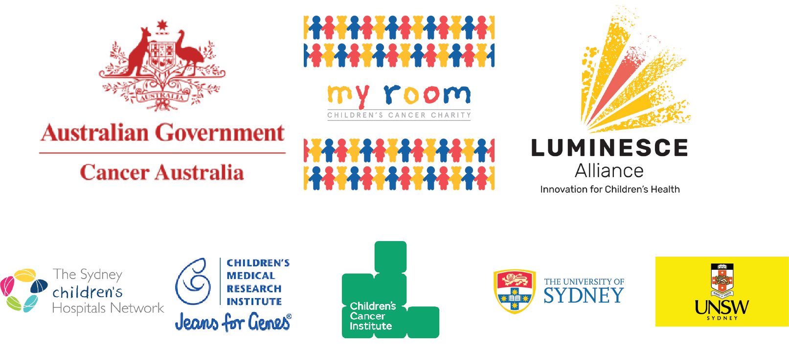

.. CRUX documentation master file, created by
   sphinx-quickstart on Wed Jun 23 06:49:29 2021.
   You can adapt this file completely to your liking, but it should at least
   contain the root `toctree` directive.

Welcome to CRUX's documentation!
================================

CRUX is a tool for analysing somatic cancer datasets at the cohort level.

Crux can be used to

#. Identify Candidate Cancer Drivers
#. Compare Genomics of Two Cohorts of Cancer
#. Examine Cohort-Level Patterns in Mutational Signatures
#. Investigate how clinical metadata are associated with cancer genomics

See **Using CRUX** for how to perform these analyses.

This documentation is a work in progress.

What is CRUX
---------------------------------

CRUX is a tool for exploring cancer cohort next-generation sequencing datasets (primarily WGS & WES)

Table Of Contents
---------------------------------

.. toctree::
   :maxdepth: 2

   usage/installation
   usage/crux_modules
   usage/importing_data
   usage/faq

   appendices/manuscript_recreation
   usage/acknowledgements

Where to get help
---------------------------------
For help with using CRUX, please `contact us`_.

We would be happy to set up a virtual meeting to provide a live demo of the tool or help resolve issues.

Funding
---------------------------------
This project was supported by grant 1165556 awarded through the 2018 Priority-driven Collaborative Cancer Research Scheme and co-funded by Cancer Australia and My Room. We would also like to acknowledge Luminesce Alliance – Innovation for Children’s Health for its contribution and support. Luminesce Alliance, is a not-for-profit cooperative joint venture between the Sydney Children’s Hospitals Network, the Children’s Medical Research Institute, and the Children’s Cancer Institute. It has been established with the support of the NSW Government to coordinate and integrate paediatric research. Luminesce Alliance is also affiliated with the University of Sydney and the University of New South Wales Sydney.

.. _`contact us`: selkamand@ccia.org.au
