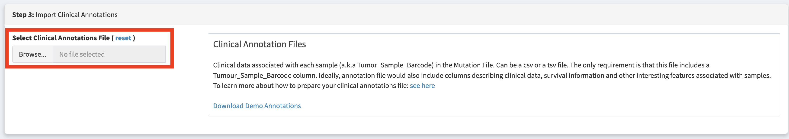
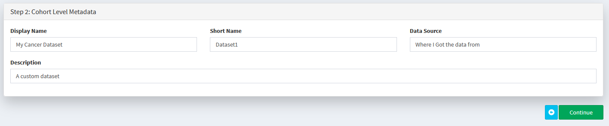
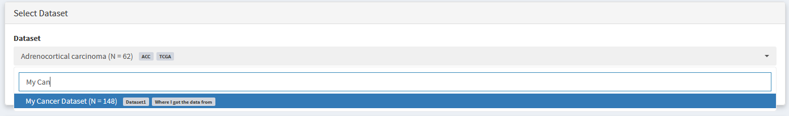

.. role:: example-box
   :class: example-box

##############################
Importing Custom Datasets
##############################

You can import your own datasets into CRUX using the **'Import Data'** module. 

Where do I start?

1. I want to :ref:`prepare mutation data for import into CRUX <Step 1>`
2. I want to :ref:`create clinical annotation files<Step 2>` files to 
   enable survival analysis / virtual cohort creation / enrichment analysis  (must already have mutation data prepared)

.. _`Step 1`:

===========================================
Step 1: Preparing your mutation data
===========================================

There are several ways to import your own data into CRUX. 

Use the table below to identify the most convenient method depending on your starting point.

+--------------------------------+----------------------------------------------------------------------+
|         Input Filetype         |                         Required Formatting                          |
+================================+======================================================================+
| MAF                            | Directly Supported: :ref:`Import Straight to CRUX<Step 3>`           |
+--------------------------------+----------------------------------------------------------------------+
| ANNOVAR (TSV)                  | Directly Supported: :ref:`Import Straight to CRUX<Step 3>`           |
+--------------------------------+----------------------------------------------------------------------+
| VCFs [2-sample, unannotated]   | :ref:`Convert to ANNOVAR<ANNOVAR>` OR :ref:`Convert to MAF<vcf2maf>` |
+--------------------------------+----------------------------------------------------------------------+
| VCFs [2-sample, vep-annotated] | :ref:`Convert to MAF<vcf2maf>`                                       |
+--------------------------------+----------------------------------------------------------------------+
| SOLID GFF3                     | Convert to ANNOVAR                                                   |
+--------------------------------+----------------------------------------------------------------------+
| Complete Genomics (TSV)        | Convert to ANNOVAR                                                   |
+--------------------------------+----------------------------------------------------------------------+
| Complete Genomics (masterVar)  | Convert to ANNOVAR                                                   |
+--------------------------------+----------------------------------------------------------------------+

------------------------------
Option 1: Import MAF file
------------------------------

In recent times, the MAF file format has become a popular, tabular way of storing mutational data. 
It is the format used by the genomic data commons that houses public TCGA and PCAWG data.

CRUX supports direct import of MAF files. 

MAF files can be quite large, but CRUX requires only a small subset of the possible columns:

+------------------------+----------------------------------------+-----------------------------------------------------------------------------+
|      Column Name       |              Description               |                                Valid Values                                 |
+========================+========================================+=============================================================================+
| Tumor_Sample_Barcode   | Sample Identifier                      | Alphanumeric                                                                |
+------------------------+----------------------------------------+-----------------------------------------------------------------------------+
| Hugo_Symbol            | Gene Name (from HUGO consortium)       | Alphanumeric                                                                |
+------------------------+----------------------------------------+-----------------------------------------------------------------------------+
| Chromosome             | Chromosome                             | Alphanumeric                                                                |
+------------------------+----------------------------------------+-----------------------------------------------------------------------------+
| Start_Position         | Mutation Start (1-based)               | Numeric                                                                     |
+------------------------+----------------------------------------+-----------------------------------------------------------------------------+
| End_Position           | Mutation End (1-based)                 | Numeric                                                                     |
+------------------------+----------------------------------------+-----------------------------------------------------------------------------+
| Reference_Allele       | Reference Allele                       | A,C,T,G (variable length)                                                   |
+------------------------+----------------------------------------+-----------------------------------------------------------------------------+
| Tumor_Seq_Allele2      | Alt Allele (present in tumour)         | A,C,T,G (variable length)                                                   |
+------------------------+----------------------------------------+-----------------------------------------------------------------------------+
| Variant_Classification | Translational effect of variant allele | See here GPT(CROSS link to Variant_Classifications data dictionary section) |
+------------------------+----------------------------------------+-----------------------------------------------------------------------------+
| Variant_Type           | Type of mutation                       | SNP,DNP,TNP,ONP,INS,DEL,Consolidated                                        |
+------------------------+----------------------------------------+-----------------------------------------------------------------------------+

If you have a MAF file, you can :ref:`Import it directly into CRUX<Step 3>`

.. _`ANNOVAR`:

----------------------------------------------------
Option 2: Create and Import ANNOVAR annotation files
----------------------------------------------------

Annovar is a widely used tool for annotating the impact of genomic variants. 
It is a standard part of many bioinformatics pipelines.

Annovar input is tabular, and includes various annotation columns, only a small subset is required for reading to work correctly.

**Required Columns:**

+------------------------------------------+------------------------------+----------------------+
|               Column Name                |         Description          |     Valid Values     |
+==========================================+==============================+======================+
| Chr                                      | Chromosome                   | e.g., 1, 2, X, Y     |
+------------------------------------------+------------------------------+----------------------+
| Start                                    | Start position               | Integer              |
+------------------------------------------+------------------------------+----------------------+
| End                                      | End position                 | Integer              |
+------------------------------------------+------------------------------+----------------------+
| Ref                                      | Reference allele             | Single base or indel |
+------------------------------------------+------------------------------+----------------------+
| Alt                                      | Alternate allele             | Single base or indel |
+------------------------------------------+------------------------------+----------------------+
| Func.refGene OR Func.ensGene             | Functional annotation        | Varies               |
+------------------------------------------+------------------------------+----------------------+
| Gene.refGene OR Gene.ensGene             | Gene symbol                  | Varies               |
+------------------------------------------+------------------------------+----------------------+
| GeneDetail.refGene OR GeneDetail.ensGene | Gene details                 | Varies               |
+------------------------------------------+------------------------------+----------------------+
| ExonicFunc.refGene OR ExonicFunc.ensGene | Exonic function annotation   | Varies               |
+------------------------------------------+------------------------------+----------------------+
| AAChange.refGene OR AAChange.ensGene     | Amino acid change annotation | Varies               |
+------------------------------------------+------------------------------+----------------------+

If you already have an ANNOVAR annotation file you can :ref:`Import it directly into CRUX<Step 3>`

Q: Ho do I get an ANNOVAR annotated file?

The easiest way is to ask you bioinformatics team to run it for you, but otherwise there are ways to do it manually without programming. 

Note this will require you to manually repeat the annotation process multiple times for single sample VCFs

**Supported File Formats**

+-----------------------------+
| Starting Filetypes          |
+=============================+
| VCFs (Single Sample)        |
+-----------------------------+
| SOLID GFF3                  |
+-----------------------------+
| Complete Genomics TSV       |
+-----------------------------+
| Complete Genomics masterVar |
+-----------------------------+

**Creating ANNOVAR files (Using only Graphical Interfaces)**

.. warning::
    For large cohorts (>10 samples) manually running ANNOVAR on each single sample VCF 
    is repetitive and time consuming. 

    Modern analysis pipelines typically output either **ANNOVAR files** 
    whch can be directly imported to CRUX or **VEP-annotated VCFs** 
    which can be converted to MAFs all at once using the **INTERCHANGE** web app.

    Please consider asking whoever runs your analysis pipelines if either ANNOVAR or VEP-annotated files are available.

1. Visit `wAnnovar <https://wannovar.wglab.org/>`__

2. Input your files (and select the matched Input Format from the
   dropdown) :download:`Example Single Sample VCF<../downloads/test_b38.vcf>`

3. Configure Paramaters

   a. Choose an appropriate reference genome.

   b. Select the relevant input format (e.g. VCF if you’ve uploaded a
      vcf file)

   c. Leave the remaining settings as default (see screenshot below for
      expected values)

    .. container:: example-box
        
        .. image:: ../images/wannovar/media/image1.png

4. Download annovar (TXT) file (genome summary results). Clicking the link will open the annotation file in a new tab. Hit ctrl/command + S to download this file.
   
    .. container:: example-box
    
        .. image:: ../images/AnnovarDownload.png

5. Repeat for each single sample VCF (or other input files) in your cohort

6. Import annovar files into CRUX 

    .. container:: example-box
        
        .. image:: ../images/AnnovarImport.png
            :alt: A screenshot of a computer Description automatically generated

**Creating ANNOVAR files (for bioinformaticians)**

We reccomend using the following settings when performing commandline annotation of annovar

``table_annovar.pl example/ex1.avinput humandb/ -buildver hg19 -out myanno -remove -protocol (refGene),cytoBand,dbnsfp30a -operation (g),r,f -nastring NA``

.. note::
    CRUX will attempt to auto-detect as much as possible about the features of your annovar annotation.
    It requires that annovar was run with gene based annotation as a first operation, before including any filter or region based annotations. 
    Please be aware that the CRUX annovar parser performs no transcript prioritization.

.. _`vcf2maf`:

----------------------------------------------------
Option 3: Convert VCFs To MAF using Interchange
----------------------------------------------------

.. note:: 
    To maximise accessibility, this section describes how to convert VCFs to MAF files using web apps only (no coding).
    
    If you are comfortable working on the commandline we reccomend trying `vcf2maf <https://github.com/mskcc/vcf2maf>`__

Interchange is the easiest way to convert vep-annotated VCFs into cohort MAF files 
compatible with CRUX.

If you have unannotated VCFs, please first annotate as described :ref:`here <vep>`:

Once you have VEP-annotated VCFs head to the `Interchange Web
App <https://ccicb.shinyapps.io/interchange/>`__ and select VCF to MAF
conversion

Then select all your VCF files as pictured below

.. image:: ../images/interchange/media/image7.png

Fill in the metadata about your cohort in the step2: panel.

You may need to alter the expected ID of tumour samples/normal samples
to match your VCFs. Most somatic variant callers used in tumor-normal
pipelines produce 2-sample vcfs with the tumour sample named ‘TUMOR’ and
the normal sample named ‘NORMAL’. This is what the interchange vcf2maf
converter expects. If your VCFs differ from this (you can open vcfs in a
text editor to check this) then you may need to change it. If tumour
sample name in your VCF changes from one sample to another, please check
‘Assume IDs in VCF match Tumor Sample Barcodes’

.. image:: ../images/interchange/media/image8.png

Example of opening up a VCF to checking how tumor and normal samples are
named

Check the VCF file -> Tumour Name Mappings and Interchange correctly
guesses the appropriate sample name for each file. You can manually
change these sample names if required.

Finally, click convert to download your MAF file.

.. _`Step 2`:

===========================================
Step 2: Prepare Clinical Annotation Files
===========================================

In addition to loading your mutation data, 
CRUX supports optional import of any clinical annotations. 
If you have any sample-level data, e.g. disease subtype, patient gender, or age,
we reccomend importing these so that they can be added to visualisations, 
used to define virtual cohorts, 
and to facilitate study of the relationships between clinical annotations and mutational profile

The clinical annotations file must be a tsv/csv with a header row. 
It must contain a ‘Tumor_Sample_Barcode’ column containing sample IDs that match the Tumor_Sample_Barcode column of your mutation file. 

You can then add as many columns where each column represents a variable.

For example:

+----------------------+-----------------+--------+
| Tumor_Sample_Barcode | Disease_Subtype | Gender |
+======================+=================+========+
| sample1              | Subtype1        | Female |
+----------------------+-----------------+--------+
| sample2              | Subtype1        | Male   |
+----------------------+-----------------+--------+
| sample3              | Subtype2        | Male   |
+----------------------+-----------------+--------+
| sample5              | Subtype2        | Male   |
+----------------------+-----------------+--------+

The file you'd actually import would be :download:`example.csv<../downloads/example_clinical.csv>`

**Survival Analysis**

To identify genetic biomarkers of good / poor survival you need to 
include survival data in your clinical annotation file. Two columns are required:

1. days_to_last_followup
2. vital_status (1=dead; 0=alive)

.. _`Step 3`:

====================================================
Step 3: Importing your dataset into CRUX
====================================================

If you want to look at your own data in CRUX, prepare your file in MAF/ANNOVAR format as described above then import it using the **'Import Data'** module

.. image:: ../images/import_data.png

Optionally import any sample level metadata (an example file can be downloaded and opened using excel).
Please see the :ref:`Prepare Clinical Annoation Files<Step 2>` section for details.

Choose a name and description for your dataset (all fields must be filled in to continue)

Add the dataset to our data pool

.. image:: ../images/import_data_4.PNG

You should now be able to select your dataset for use in any of the analysis/visualisation modules

.. _`vep`:

================================================================
Annotating Variants with VEP (Graphical tools only)
================================================================

1. Navigate to `VEP <https://asia.ensembl.org/Tools/VEP>`__ and create a
   new job

2. Ensure the chosen ‘Assembly’ is appropriate. If your variants are
   called based on hg38/GRCh38 reference genomes the link above is
   appropriate. If your pipelines use hg19/GRCh37 reference genomes
   you’ll need to use `the GRCh37
   version <http://grch37.ensembl.org/Homo_sapiens/Tools/VEP>`__

    .. image:: ../images/interchange/media/image1.png

3. Upload your VCF

4. Configure Vep with the following settings

   a. **Transcript Database to Use:** Default Ensembl/GENCODE
      transcripts are fine. 
      
      .. note::
        You can  use other transcript
        databases so long as you ensure consistency between the VCFs in
        your cohort (and any other cohort you want to compare results to)

    .. image:: ../images/interchange/media/image2.png

b.  **Identifiers:** Check *Gene Symbol* & *Transcript Version* & *HGVS*

    .. image:: ../images/interchange/media/image3.png

c. **Additional Annotations > Transcript Annotation:** Check *Transcript
   Biotype* & *Identify Canonical Transcripts*

   .. image:: ../images/interchange/media/image4.png

d. **Variants and Frequency Data:** check *gnomAD (exomes) allele
   frequencies*

   .. image:: ../images/interchange/media/image5.png

5. Run VEP and download results as VCF

   .. image:: ../images/interchange/media/image6.png

6. Repeat for each VCF in your cohort

====================================================
Data Dictionaries 
====================================================

A collection of data dictionaries for various filetypes

----------------------------------------------------
(MAF) Variant_Classifications
----------------------------------------------------

+------------------------+
|        Frame_Shift_Del |
+------------------------+
|        Frame_Shift_Ins |
+------------------------+
|           In_Frame_Del |
+------------------------+
|           In_Frame_Ins |
+------------------------+
|      Missense_Mutation |
+------------------------+
|      Nonsense_Mutation |
+------------------------+
|                 Silent |
+------------------------+
|            Splice_Site |
+------------------------+
| Translation_Start_Site |
+------------------------+
|       Nonstop_Mutation |
+------------------------+
