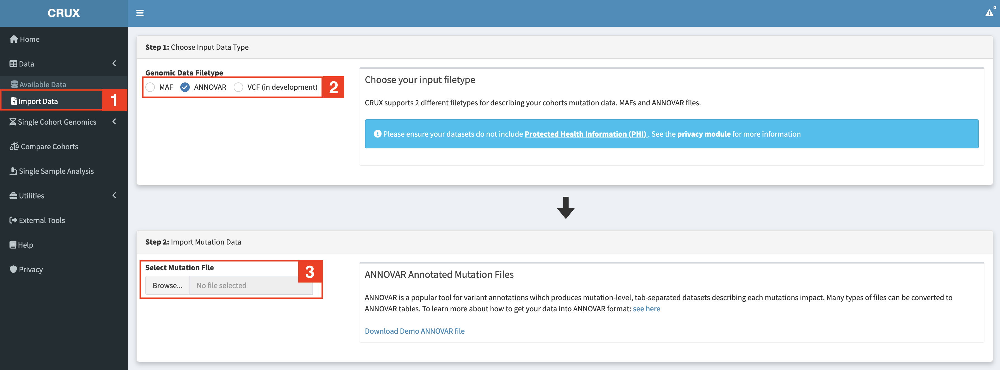
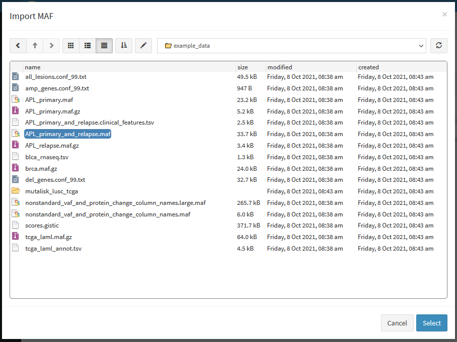
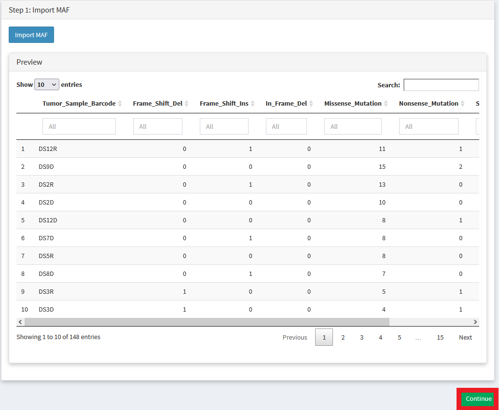
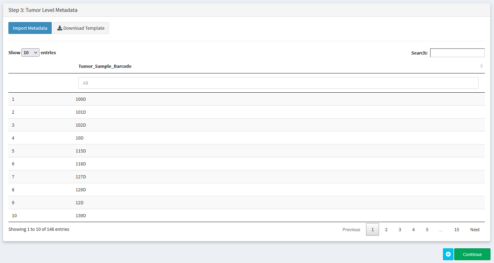
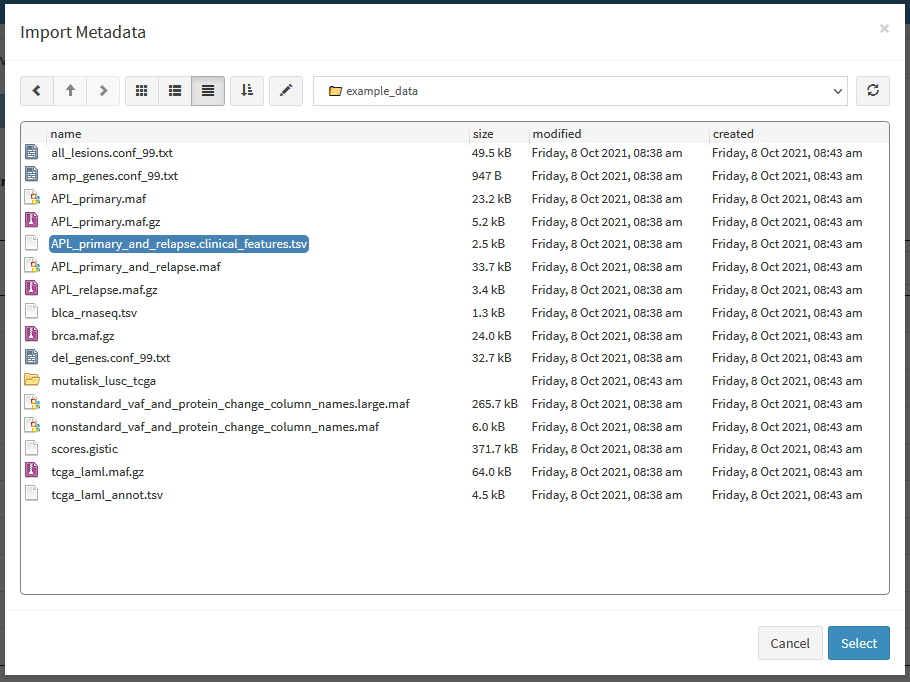
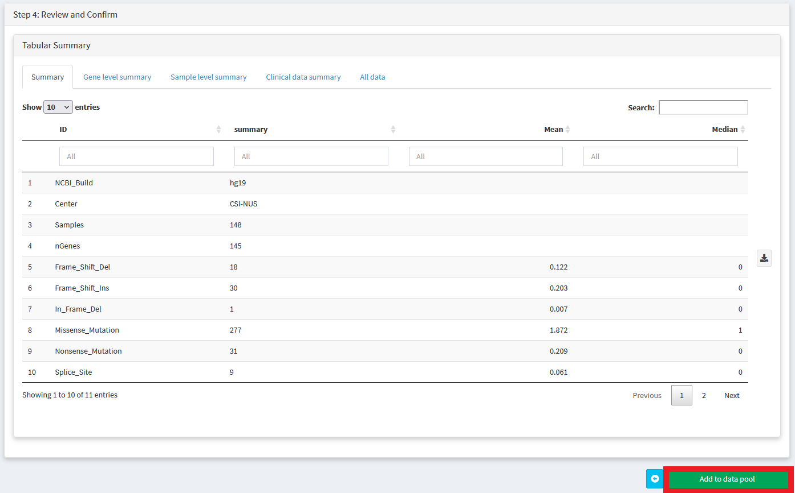

##############################
Importing Custom Datasets
##############################

You can import your own datasets into CRUX using the **'Import Data'** module. 

Where do I start?

1. If have single sample VCFs which have not been annotated by ANNOVAR / VEP: Start here :ref:`Step 1`.
2. If you already have MAF files and want to create clinical annotations file to add annotaitons to oncoplots / enable survival analysis: Start here :ref:`Step 2`
3. If you already have a single MAF / ANNOVAR file describing all mutations in your custom cohort: Start here :ref:`Step 3`

.. _`Step 1`:

===========================================
Step 1: Preparing your mutation data
===========================================

There are several ways to import your own data into CRUX. 

Use the table below to identify the most convenient method depending on your starting point.

+-------------------------------+---------------------------------------------------------------------------+
|        Input Filetype         |                            Required Formatting                            |
+===============================+===========================================================================+
| MAF                           | Directly Supported. Import Straight to CRUX                               |
+-------------------------------+---------------------------------------------------------------------------+
| ANNOVAR (multisample)         | Directly Supported. Import Straight to CRUX                               |
+-------------------------------+---------------------------------------------------------------------------+
| VCF (multi sample)            | Convert to ANNOVAR GPT(LINK TO Create and Import ANNOVAR annotated files) |
+-------------------------------+---------------------------------------------------------------------------+
| VCF (single sample)           | Convert to ANNOVAR GPT(LINK TO Create and Import ANNOVAR annotated files) |
+-------------------------------+---------------------------------------------------------------------------+
| SOLID GFF3                    | Convert to ANNOVAR GPT(LINK TO Create and Import ANNOVAR annotated files) |
+-------------------------------+---------------------------------------------------------------------------+
| Complete Genomics (TSV)       | Convert to ANNOVAR GPT(LINK TO Create and Import ANNOVAR annotated files) |
+-------------------------------+---------------------------------------------------------------------------+
| Complete Genomics (masterVar) | Convert to ANNOVAR GPT(LINK TO Create and Import ANNOVAR annotated files) |
+-------------------------------+---------------------------------------------------------------------------+

**Option 1: Import MAF file**

In recent times, the MAF file format has become a popular, tabular way of storing mutational data. 
It is the format used by the genomic data commons that houses public TCGA and PCAWG data.

CRUX supports direct import of MAF files. 

MAF files can be quite large, but CRUX requires only a small subset of the possible columns:

+------------------------+----------------------------------------+-----------------------------------------------------------------------------+
|      Column Name       |              Description               |                                Valid Values                                 |
+========================+========================================+=============================================================================+
| Tumor_Sample_Barcode   | Sample Identifier                      | Alphanumeric                                                                |
+------------------------+----------------------------------------+-----------------------------------------------------------------------------+
| Hugo_Symbol            | Gene Name (from HUGO consortium)       | Alphanumeric                                                                |
+------------------------+----------------------------------------+-----------------------------------------------------------------------------+
| Chromosome             | Chromosome                             | Alphanumeric                                                                |
+------------------------+----------------------------------------+-----------------------------------------------------------------------------+
| Start_Position         | Mutation Start (1-based)               | Numeric                                                                     |
+------------------------+----------------------------------------+-----------------------------------------------------------------------------+
| End_Position           | Mutation End (1-based)                 | Numeric                                                                     |
+------------------------+----------------------------------------+-----------------------------------------------------------------------------+
| Reference_Allele       | Reference Allele                       | A,C,T,G (variable length)                                                   |
+------------------------+----------------------------------------+-----------------------------------------------------------------------------+
| Tumor_Seq_Allele2      | Alt Allele (present in tumour)         | A,C,T,G (variable length)                                                   |
+------------------------+----------------------------------------+-----------------------------------------------------------------------------+
| Variant_Classification | Translational effect of variant allele | See here GPT(CROSS link to Variant_Classifications data dictionary section) |
+------------------------+----------------------------------------+-----------------------------------------------------------------------------+
| Variant_Type           | Type of mutation                       | SNP,DNP,TNP,ONP,INS,DEL,Consolidated                                        |
+------------------------+----------------------------------------+-----------------------------------------------------------------------------+

Q: How do I convert VCFs to MAF files

If you have a VCF and programming skills, we'd reccomend trying GPT(vcf2maf: add hyperlink https://github.com/mskcc/vcf2maf ).

Otherwise try converting to an ANNOVAR file as described below - then import the ANNOVAR directly into CRUX

**Option 2: Create and Import ANNOVAR annotated files**

Annovar is a widely used tool for annotating the impact of genomic variants. 
It is a standard part of many bioinformatics pipelines, so if you have ANNOVAR files in your workflow.

Annovar input is tabular, and includes various annotation columns, only a small subset is required for reading to work correctly.

**Required Columns:**

+------------------------------------------+------------------------------+----------------------+
|               Column Name                |         Description          |     Valid Values     |
+==========================================+==============================+======================+
| Chr                                      | Chromosome                   | e.g., 1, 2, X, Y     |
+------------------------------------------+------------------------------+----------------------+
| Start                                    | Start position               | Integer              |
+------------------------------------------+------------------------------+----------------------+
| End                                      | End position                 | Integer              |
+------------------------------------------+------------------------------+----------------------+
| Ref                                      | Reference allele             | Single base or indel |
+------------------------------------------+------------------------------+----------------------+
| Alt                                      | Alternate allele             | Single base or indel |
+------------------------------------------+------------------------------+----------------------+
| Func.refGene OR Func.ensGene             | Functional annotation        | Varies               |
+------------------------------------------+------------------------------+----------------------+
| Gene.refGene OR Gene.ensGene             | Gene symbol                  | Varies               |
+------------------------------------------+------------------------------+----------------------+
| GeneDetail.refGene OR GeneDetail.ensGene | Gene details                 | Varies               |
+------------------------------------------+------------------------------+----------------------+
| ExonicFunc.refGene OR ExonicFunc.ensGene | Exonic function annotation   | Varies               |
+------------------------------------------+------------------------------+----------------------+
| AAChange.refGene OR AAChange.ensGene     | Amino acid change annotation | Varies               |
+------------------------------------------+------------------------------+----------------------+

Q: Ho do I get an ANNOVAR annotated file?

The easiest way is to ask you bioinformatics team to run it for you , but otherwise there are ways to do it manually without programming.

**Starting Point: Single Sample VCFs**

+-----------------------------+
| Starting Filetypes          |
+=============================+
| VCFs (Single Sample)        |
+-----------------------------+
| SOLID GFF3                  |
+-----------------------------+
| Complete Genomics TSV       |
+-----------------------------+
| Complete Genomics masterVar |
+-----------------------------+

1.  Visit `wAnnovar <https://wannovar.wglab.org/>`_ 
2.  Input your files (and select the matched Input Format from the dropdown)
3.  Choose an appropriate reference genome 
4.  Select RefSeq Gene as your gene definition
5.  Select individual analysis if using a single sample tumour VCF (ensure your tumour is the first sample in the VCF). 
6.  Repeat for each tumour VCF you have

CRUX will attempt to auto-detect as much as possible about the features of your annovar annotation.
CRUX import functionality converts annovar output files into MAFs. 
It requires that annovar was run with gene based annotation as a first operation, before including any filter or region based annotations. 
Please be aware that the CRUX annovar parser performs no transcript prioritization.

**For Bioinformaticians**

We reccomend using the following settings when performing commandline annotation of annovar

``table_annovar.pl example/ex1.avinput humandb/ -buildver hg19 -out myanno -remove -protocol (refGene),cytoBand,dbnsfp30a -operation (g),r,f -nastring NA``

**Option 2: INTERCHANGE (VCF2MAF)**

.. _`Step 2`:

===========================================
Step 2: Prepare Clinical Annotation Files
===========================================

In addition to loading your mutation data, 
CRUX supports optional import of any clinical annotations. 
If you have any sample-level data, e.g. disease subtype, patient gender, or age,
we reccomend importing these so that they can be added to visualisations, 
used to define virtual cohorts, 
and to facilitate study of the relationships between clinical annotations and mutational profile

The clinical annotations file must be a tsv/csv with a header row. 
It must contain a ‘Tumor_Sample_Barcode’ column containing sample IDs that match the Tumor_Sample_Barcode column of your mutation file. 

You can then add as many columns where each column represents a variable.

For example:

+----------------------+-----------------+--------+
| Tumor_Sample_Barcode | Disease_Subtype | Gender |
+======================+=================+========+
| sample1              | Subtype1        | Female |
+----------------------+-----------------+--------+
| sample2              | Subtype1        | Male   |
+----------------------+-----------------+--------+
| sample3              | Subtype2        | Male   |
+----------------------+-----------------+--------+
| sample5              | Subtype2        | Male   |
+----------------------+-----------------+--------+

The file you'd actually import would be <add link to CSV version of above>

.. _`Step 3`:

====================================================
Step 3: Importing your dataset into CRUX
====================================================

If you want to look at your own data in CRUX, prepare your file in MAF format then import it using the **'Import Data'** module

Crux comes pre-packaged with an example MAF in the **example_data** folder (APL_primary_and_relaps.maf)

Selecting a MAF will produce a summary table. Review then click continue:

Choose a name for your dataset (all fields must be filled in to continue)

.. image:: ../images/import_data4.PNG

Optionally import any sample level metadata (an example metadata file template can be downloaded and opened using excel).
Sample metadata file must be a tsv/csv with a header row. It must contain a **'Tumor_Sample_Barcode'** column containing sample IDs that match the **Tumor_Sample_Barcode** column of your MAF file.
Please see the **FAQ** if you have any trouble with preparing your custom dataset

We'll import the APL_primary_and_relapse.clinical_features.tsv file that matches our dataset.

Review once more then we'll add it to our data pool

You should now be able to select your dataset for use in any of the analysis/visualisation modules

.. image:: ../images/import_data8.PNG

Here we describe how to prepare the mutation and clinical annotation files you'll need.

====================================================
Data Dictionaries 
====================================================

A collection of data dictionaries for various filetypes

----------------------------------------------------
(MAF) Variant_Classifications
----------------------------------------------------

+------------------------+
|        Frame_Shift_Del |
+------------------------+
|        Frame_Shift_Ins |
+------------------------+
|           In_Frame_Del |
+------------------------+
|           In_Frame_Ins |
+------------------------+
|      Missense_Mutation |
+------------------------+
|      Nonsense_Mutation |
+------------------------+
|                 Silent |
+------------------------+
|            Splice_Site |
+------------------------+
| Translation_Start_Site |
+------------------------+
|       Nonstop_Mutation |
+------------------------+
