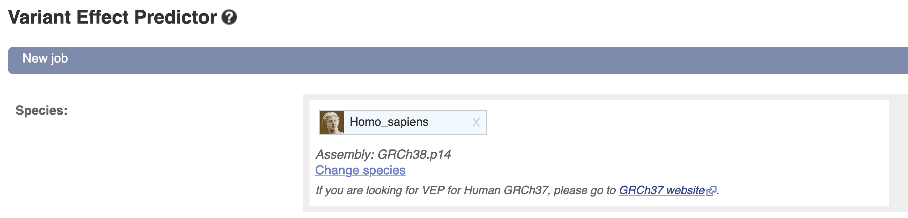
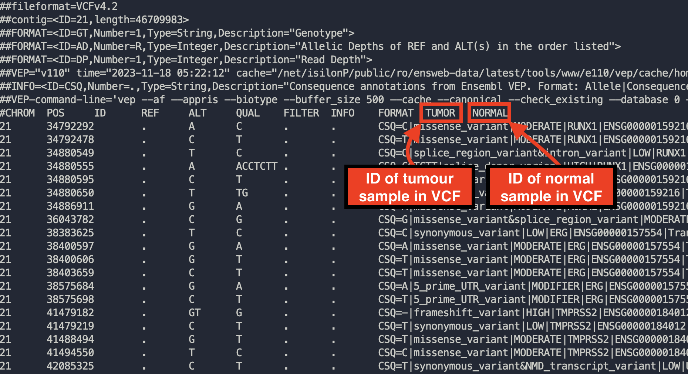
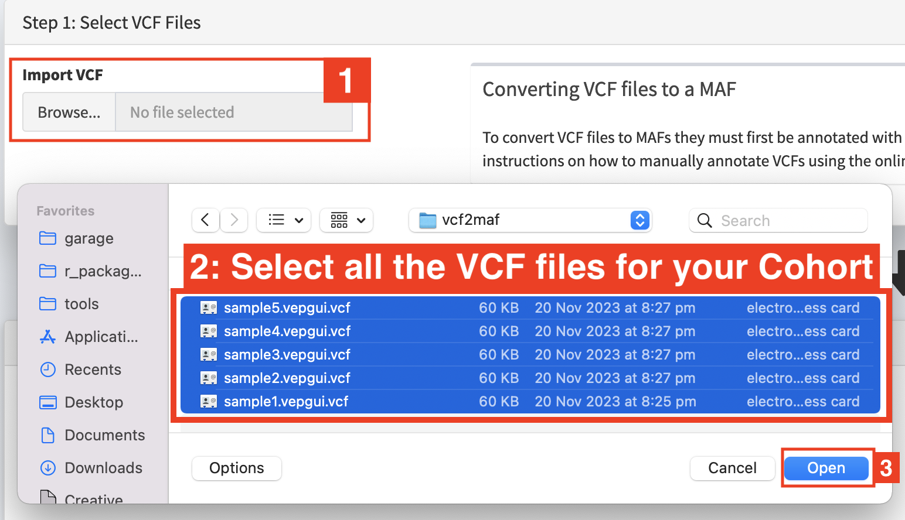

**Running VEP**

Before converting VCFs to MAFs you must ensure the VCFs are annotated
using VEP

1. Navigate to `VEP <https://asia.ensembl.org/Tools/VEP>`__ and create a
   new job

2. Ensure the chosen ‘Assembly’ is appropriate. If your variants are
   called based on hg38/GRCh38 reference genomes the link above is
   appropriate. If your pipelines use hg19/GRCh37 reference genomes
   you’ll need to use `the GRCh37
   version <http://grch37.ensembl.org/Homo_sapiens/Tools/VEP>`__

3. Upload your VCF

4. Configure Vep with the following settings

   a. **Transcript Database to Use:** Default of Ensembl/GENCODE
      transcripts. You can actually change to use other transcript
      databases so long as you ensure consistency between the VCFs in
      your cohort (and any other cohort you want to compare results to)

..

   .. image:: ../images/interchange/media/image2.png
      :alt: A screenshot of a computer Description automatically
      generated
      :width: 6.26389in
      :height: 1.40833in

b. **Identifiers:** Check *Gene Symbol* & *Transcript Version* & *HGVS*

..

   .. image:: ../images/interchange/media/image3.png
      :width: 6.26389in
      :height: 4.56528in

c. **Additional Annotations > Transcript Annotation:** Check *Transcript
   Biotype* & *Identify Canonical Transcripts*

..

   .. image:: ../images/interchange/media/image4.png
      :width: 6.26389in
      :height: 5.39861in

d. **Variants and Frequency Data:** check *gnomAD (exomes) allele
   frequencies*

..

   .. image:: ../images/interchange/media/image5.png
      :alt: A screenshot of a computer Description automatically
      generated
      :width: 6.26389in
      :height: 3.96319in

5. Run VEP and download results as VCF

..

   .. image:: ../images/interchange/media/image6.png
      :width: 2.36111in
      :height: 1.06944in

**Interchange (vcf2maf)**

Once you have your VEP-annotated VCFs head to the `Interchange web
app <https://ccicb.shinyapps.io/interchange/>`__ and select VCF to MAF
conversion

Then select all your VCF files as pictured below\ |image1|

Fill in the metadata about your cohort in the step2: panel.

You may need to alter the expected ID of tumour samples/normal samples
to match your VCFs. Most somatic variant callers used in tumor-normal
pipelines produce 2-sample vcfs with the tumour sample named ‘TUMOR’ and
the normal sample named ‘NORMAL’. This is what the interchange vcf2maf
converter expects. If your VCFs differ from this (you can open vcfs in a
text editor to check this) then you may need to change it. If tumour
sample name in your VCF changes from one sample to another, please check
‘Assume IDs in VCF match Tumor Sample Barcodes’

Example of opening up a VCF to checking how tumor and normal samples are
named

Check the VCF file -> Tumour Name Mappings and Interchange correctly
guesses the appropriate sample name for each file. You can manually
change these sample names if required.

Once you’re finished click convert to download your MAF file.

