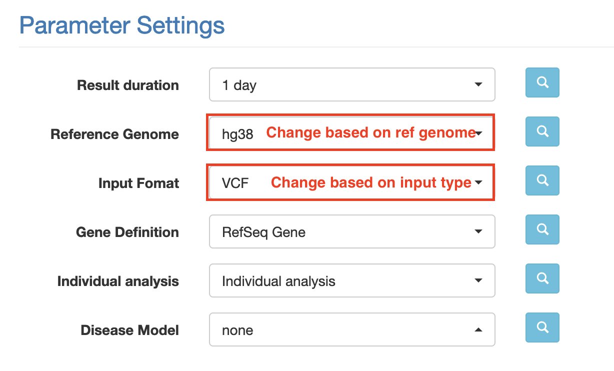

1. Visit `wAnnovar <https://wannovar.wglab.org/>`__

2. Input your files (and select the matched Input Format from the
   dropdown)

3. Configure Paramaters

   a. Choose an appropriate reference genome.

   b. Select the relevant input format (e.g. VCF if you’ve uploaded a
      vcf file

   c. Leave the remaining settings as default (see screenshot below for
      expected values)

