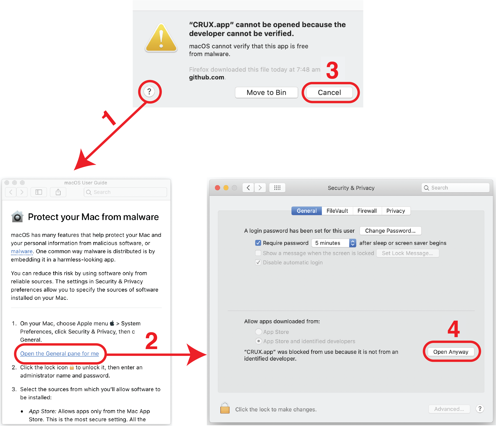

##############################
Installing CRUX
##############################

.. contents:: Compatible Operating Systems
	:local:
	:depth: 1

====================================================
Windows
====================================================
#. Download the CRUX app for Windows (link_)
#. Unzip the app
#. Run **CRUX.bat**

====================================================
Mac
====================================================
#. Download the CRUX app for Mac (link_)
#. Double click the zipfile to extract the app
#. Run **CRUX.app**
#. If you see a warning about running apps from unverified developers: Resolve as below

====================================================
Linux
====================================================

CRUX can be installed on linux (or any other R-compatible) operating system as an R package.

#. Install R
#. Install CRUX by running::

	# Install required libraries
	install.packages("remotes", ask=FALSE)
	install.packages("BiocManager", ask=FALSE)

	# Install tool
	BiocManager::install("PoisonAlien/TCGAmutations")
	remotes::install_github("CCICB/CRUX")

#. Then, whenever you want to open **CRUX** run::
	CRUX::run_app()

.. _link: https://github.com/CCICB/CRUX/releases/tag/v1.0.0
